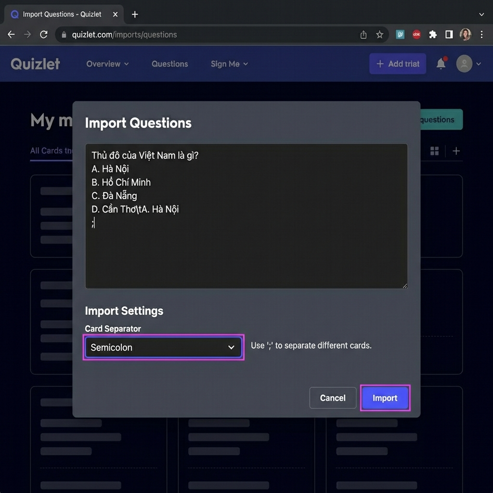
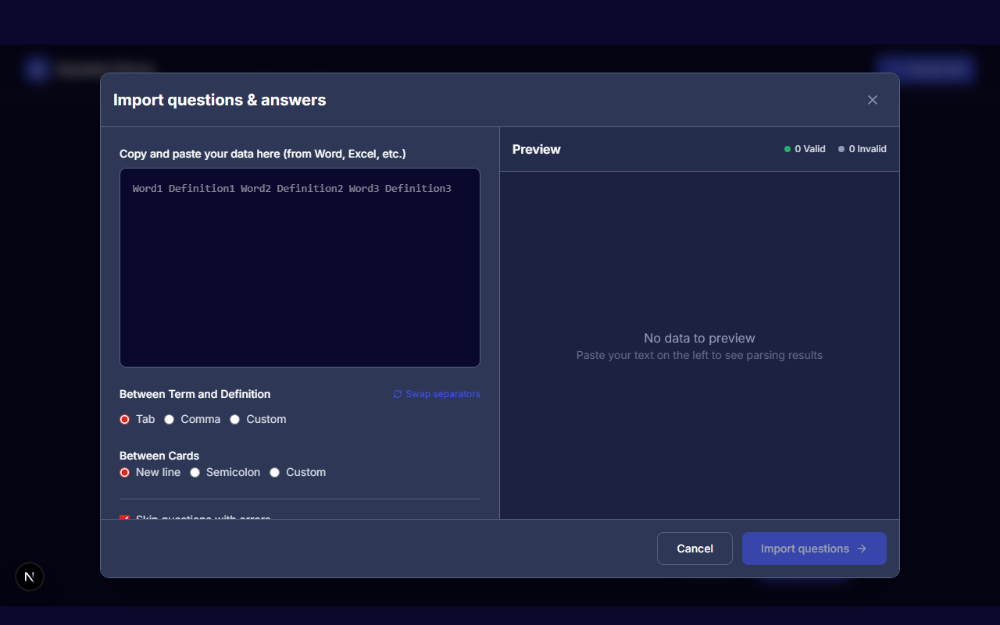
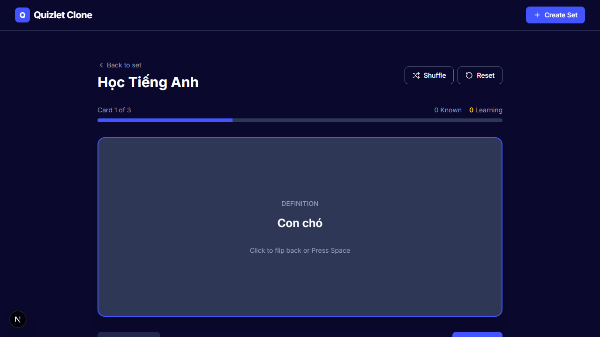
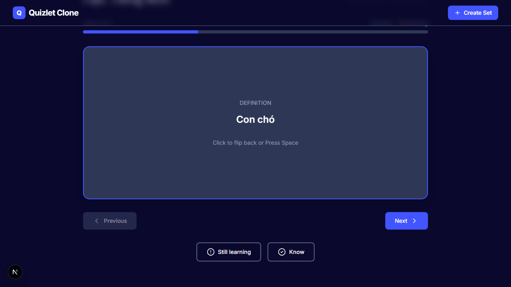

# Hướng dẫn: Import và Học Câu hỏi Trắc nghiệm (4 Đáp án)

Tài liệu này hướng dẫn quy trình chuyên biệt để **nhập hàng loạt câu hỏi trắc nghiệm** từ file tài liệu (Word/Excel) và ôn tập chúng trên hệ thống.

---

## 1. Chuẩn bị Dữ liệu
Để hệ thống hiển thị tốt câu hỏi có 4 đáp án (A, B, C, D), bạn cần định dạng dữ liệu theo quy tắc sau:

1.  **Câu hỏi và các đáp án** nằm chung một nhóm (Cột Thuật ngữ/Term).
2.  **Đáp án đúng** nằm riêng (Cột Định nghĩa/Definition).
3.  **Ngăn cách các thẻ (Questions):** Sử dụng dấu chấm phẩy `;` hoặc một ký tự đặc biệt (ví dụ `===`) để tách biệt các câu hỏi.

**Mẫu dữ liệu chuẩn (Copy mẫu này để dùng):**

```text
Thủ đô của Việt Nam là gì?
A. Hà Nội
B. Hồ Chí Minh
C. Đà Nẵng
D. Cần Thơ	A. Hà Nội
===
2 + 2 bằng mấy?
A. 1
B. 3
C. 4
D. 5	C. 4
===
Ai là người đầu tiên đặt chân lên mặt trăng?
A. Yuri Gagarin
B. Neil Armstrong
C. Buzz Aldrin
D. Michael Collins	B. Neil Armstrong
```

*(Lưu ý: Giữa phần câu hỏi và đáp án đúng là một khoảng trắng Tab)*

---

## 2. Quy trình Import (Nhập liệu)

### Bước 1: Mở công cụ Import và Dán dữ liệu
Tại màn hình tạo bộ thẻ mới (**Create Set**), nhấn vào nút **Import**. Sau đó, dán nội dung câu hỏi trắc nghiệm của bạn vào ô văn bản.



### Bước 2: Cấu hình và Hoàn tất
1.  **Cấu hình phân cách:** Chọn **Semicolon (;)** tại mục *Card Separator* nếu bạn dùng dấu chấm phẩy để tách các câu hỏi.
2.  **Kiểm tra Preview:** Xem trước các thẻ ở bảng bên phải để đảm bảo dữ liệu hiển thị đúng.
3.  **Nhấn Import:** Xác nhận để đưa toàn bộ câu hỏi vào bộ thẻ.



---

## 3. Quy trình Học tập (Flashcards)

Khi học bộ thẻ trắc nghiệm này, giao diện sẽ hiển thị như sau:

**Mặt trước (Câu hỏi):**
Hệ thống hiển thị đầy đủ câu hỏi và 4 phương án lựa chọn.


**Mặt sau (Đáp án):**
Bạn tự chọn đáp án, sau đó lật thẻ để kiểm tra kết quả đúng.



**Đánh giá:**
*   Nếu bạn chọn đúng: Nhấn **Know** (Đã biết).
*   Nếu bạn chọn sai: Nhấn **Still Learning** (Cần học lại).



---
*Tài liệu hướng dẫn nghiệp vụ dành cho người dùng cuối.*
