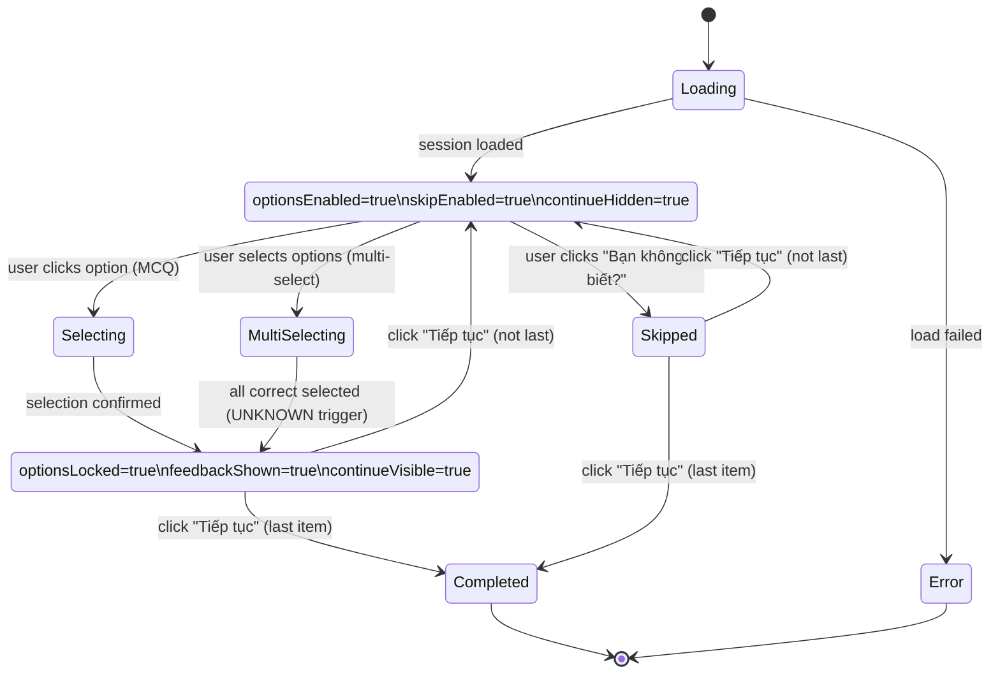
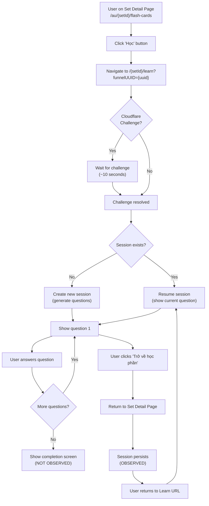
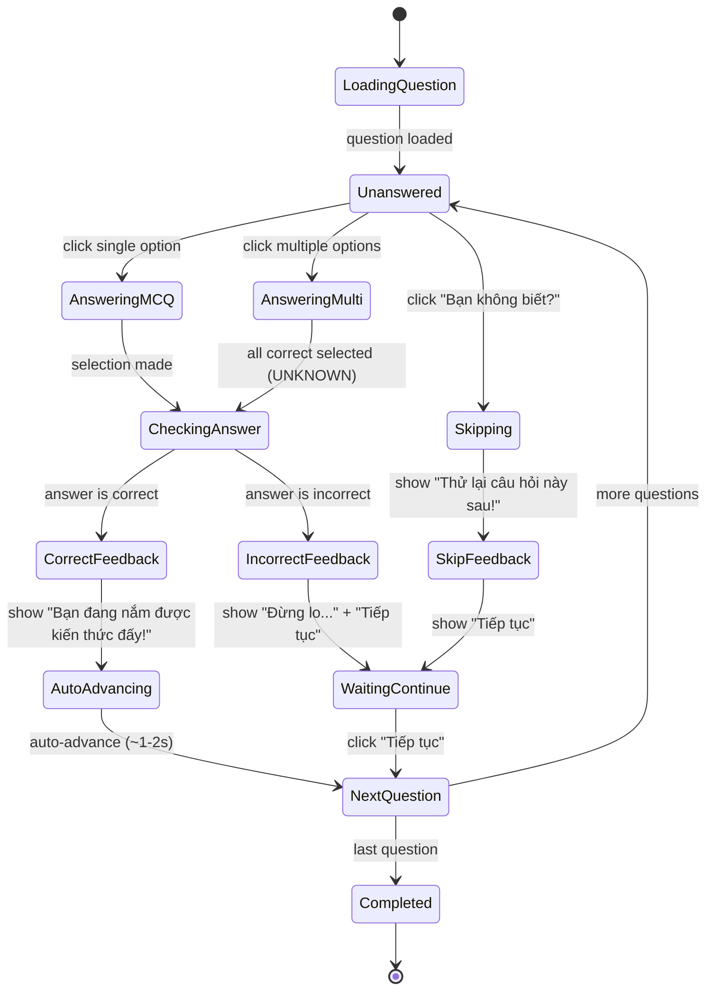
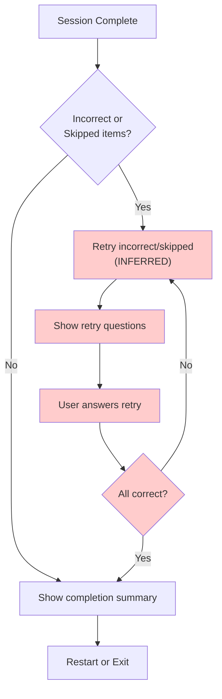

# Quizlet Learn Mode — Discovery Technical Requirement Specification

**Document language**: English  
**All user-facing UI copy**: Vietnamese (exact strings observed from Quizlet)  
**Audience**: Frontend AI implementers, QA AI for E2E tests  
**Source**: Direct observation via browser automation of Quizlet.com  
**Discovery date**: 2025-01-25  
**Status**: OBSERVED / INFERRED / UNKNOWN labels used throughout

---

## 0) Scope and Non-Scope

### In scope (OBSERVED)
- Learn Mode route and entry from flashcard set detail page
- Multiple question types: MCQ (single-select), Multi-select ("Chọn tất cả phương án phù hợp"), Written ("Tự luận") — OBSERVED in settings
- Question generation from flashcard set (Term ↔ Definition direction)
- Answer feedback: correct, incorrect, skip ("Bạn không biết?")
- Progress tracking and display (current/total)
- Session persistence: exit and resume behavior
- Settings menu: shuffle, sound effects, question type preferences
- Exit/return navigation

### Out of scope (NOT OBSERVED or EXPLICITLY NOT TESTED)
- Authentication/login flow
- Server-side sync across devices (only local session persistence observed)
- Spaced repetition algorithm details (only basic retry of incorrect/skipped observed)
- Teacher/classroom features
- Audio/TTS functionality (sound button present but not tested)
- Completion screen (not reached during discovery)
- Adaptive retry algorithm details (only basic behavior observed)

---

## 1) Definitions and Terminology

### 1.1 Flashcard Set
- **Set**: Collection of flashcards
  - `id: string` (e.g., `"707889351"`)
  - `title: string` (e.g., `"CQIB FINAL EXAM"`)
  - `cards: Card[]`

### 1.2 Card
- **Card**: A flashcard with term and definition
  - `id: string` (inferred, not directly observed)
  - `term: string` (displayed as "Thuật ngữ" or "Định nghĩa" depending on question direction)
  - `definition: string` (displayed as prompt or answer)

### 1.3 Learn Session
- **Session**: A run of Learn Mode for a set
  - `sessionId: string` (inferred from network requests: `"28392633274"`)
  - `setId: string`
  - `items: LearnItem[]` (ordered questions)
  - `currentIndex: number` (0-based, displayed as 1-based in UI)
  - `totalItems: number` (e.g., `122`)
  - Persists across page refresh (OBSERVED)

### 1.4 Learn Item
- **Item**: A single question in the session
  - `itemId: string` (inferred, stable within session)
  - `cardId: string` (inferred)
  - `type: "MCQ" | "MULTI_SELECT" | "WRITTEN"` (OBSERVED in settings)
  - `direction: "TERM_TO_DEF" | "DEF_TO_TERM"` (OBSERVED: "Thuật ngữ" vs "Định nghĩa")
  - `prompt: string` (question text)
  - `correctAnswer: string | string[]` (single or multiple)
  - `options: Option[]` (for MCQ/Multi-select)
  - `status: "UNANSWERED" | "CORRECT" | "INCORRECT" | "SKIPPED"` (inferred)

### 1.5 Option
- **Option**: A choice in MCQ or multi-select question
  - `optionId: string` (inferred)
  - `label: string` (displayed text)
  - `isCorrect: boolean`
  - `isSelected: boolean` (for multi-select)

---

## 2) Routes and Entry Points

### 2.1 Canonical route (OBSERVED)
- **URL Pattern**: `https://quizlet.com/{setId}/learn?funnelUUID={uuid}`
  - Example: `https://quizlet.com/707889351/learn?funnelUUID=10f02094-ae1e-49f1-8f4c-c0c52d5a25e0`
  - `funnelUUID` appears to be optional tracking parameter (OBSERVED)

### 2.2 Entry points (OBSERVED)
- **From Set Detail Page**: Button labeled `"Học"` (Learn)
  - Located in header/navigation area
  - Clicking navigates to `/learn` route
  - **Intermediate screen**: Cloudflare challenge may appear (OBSERVED, resolved automatically)

### 2.3 Exit points (OBSERVED)
- **Return to Set**: Button labeled `"Trở về học phần"` (Return to set)
  - Located in top-right header area
  - Returns to set detail page
  - Session persists (OBSERVED: resuming shows same question index)

### 2.4 Navigation behavior (OBSERVED)
- Browser back button: Returns to set detail page
- Direct URL access: Resumes session if in progress (OBSERVED: question 5 persisted after exit/return)

---

## 3) UX Screens and States

### 3.1 Header Bar (OBSERVED)
**Visible elements:**
- Left: `"Học"` button (dropdown menu, not tested)
- Center-right: `"Mở khóa quyền truy cập không giới hạn"` (Upgrade button, not tested)
- Right: `"Tùy chọn"` (Options) button with settings icon
- Right: `"Trở về học phần"` (Return to set) button with close icon

### 3.2 Progress Indicator (OBSERVED)
**Visible elements:**
- Current question number (e.g., `"6"`)
- Total questions (e.g., `"122"`)
- Visual progress indicator (image/icon, not detailed)

**Location**: Below header, above question card

### 3.3 Question Screen — MCQ (OBSERVED)
**Layout:**
- **Prompt section:**
  - Label: `"Định nghĩa"` or `"Thuật ngữ"` (direction indicator)
  - Sound button (speaker icon)
  - Question text (definition or term)
- **Options section:**
  - 4 option buttons (numbered 1-4)
  - Each option displays text label
  - Clickable/tappable
- **Actions:**
  - `"Báo cáo câu hỏi này"` (Report question) icon
  - `"Bạn không biết?"` (Don't know?) button

**After selection — Feedback state (OBSERVED):**
- **Correct answer:**
  - Message: `"Bạn đang nắm được kiến thức đấy!"` (You're getting it!)
  - Visual: Checkmark icon on selected option
  - Auto-advance: Automatically moves to next question (OBSERVED: ~1-2 second delay)
- **Incorrect answer:**
  - Message: `"Đừng lo, bạn vẫn đang học mà! Câu trả lời đúng: {correctAnswer}"` (Don't worry, you're still learning! Correct answer: ...)
  - Visual: X mark on selected option, checkmark on correct option
  - Action required: `"Tiếp tục"` (Continue) button appears
  - Options locked (cannot change selection)

### 3.4 Question Screen — Multi-select (OBSERVED)
**Layout:**
- **Prompt section:** Same as MCQ
- **Options section:**
  - Multiple options (observed: 10 options)
  - Label: `"Chọn tất cả phương án phù hợp (còn {remaining})"` (Select all that apply (remaining: X))
  - As user selects options, counter decreases
  - Selected options show checkmark
  - Correct answers revealed as selected: `"Câu trả lời đúng: {answer}"` (Correct answer: ...)
- **Actions:** Same as MCQ

**Behavior (OBSERVED):**
- User can select multiple options
- Counter shows remaining correct answers to select
- Correct answers are revealed as user selects them
- Status: UNKNOWN — when is question considered complete? (not fully tested)

### 3.5 Settings Menu (OBSERVED)
**Visible when clicking `"Tùy chọn"` button:**
- **Shuffle**: `"Trộn thẻ"` (Shuffle cards) button (toggle, not tested)
- **Starred terms**: `"Học thuật ngữ có gắn sao"` (Study starred terms) button (disabled in observed session)
- **Sound effects**: `"Hiệu ứng âm thanh"` (Sound effects) button (active/pressed state observed)
- **Question types section:**
  - `"Loại câu hỏi"` (Question types) label
  - Toggle switches:
    - `"Trắc nghiệm"` (Multiple choice) — checked
    - `"Chọn tất cả phương án phù hợp"` (Select all that apply) — checked
    - `"Tự luận"` (Written) — checked
- **View all options**: `"Xem tất cả các tùy chọn"` (View all options) button (not tested)

**Behavior (OBSERVED):**
- Menu appears as overlay/modal
- Can be dismissed (not tested how)
- Settings persist (inferred, not explicitly tested)

### 3.6 Skip Behavior (OBSERVED)
**When clicking `"Bạn không biết?"` button:**
- Message: `"Thử lại câu hỏi này sau!"` (Try this question again later!)
- All correct answers revealed with checkmarks
- Status label: `"Đã bỏ qua"` (Skipped)
- Action required: `"Tiếp tục"` button appears
- Question marked as skipped (inferred: will be retested later)

### 3.7 Loading/Error States
- **Loading**: UNKNOWN (not observed during discovery)
- **Error**: UNKNOWN (not observed during discovery)
- **Empty set**: UNKNOWN (not observed during discovery)

### 3.8 Completion Screen
- **Status**: NOT OBSERVED (session not completed during discovery)
- **Inferred**: Likely shows summary of correct/incorrect/skipped counts and restart option

---

## 4) State Model

### 4.1 Session State
```typescript
interface LearnSession {
  sessionId: string;
  setId: string;
  items: LearnItem[];
  currentIndex: number;
  totalItems: number;
  settings: {
    shuffle: boolean;
    soundEffects: boolean;
    questionTypes: {
      mcq: boolean;
      multiSelect: boolean;
      written: boolean;
    };
  };
  startedAt: timestamp; // inferred
  lastUpdatedAt: timestamp; // inferred
}
```

### 4.2 Item State
```typescript
interface LearnItem {
  itemId: string;
  cardId: string;
  type: "MCQ" | "MULTI_SELECT" | "WRITTEN";
  direction: "TERM_TO_DEF" | "DEF_TO_TERM";
  prompt: string;
  correctAnswer: string | string[];
  options?: Option[];
  status: "UNANSWERED" | "CORRECT" | "INCORRECT" | "SKIPPED";
  selectedAnswer?: string | string[];
  feedbackShown: boolean;
}
```

### 4.3 Question Screen State Machine


---

## 5) Mermaid Flow Diagrams

### 5.1 Entry and Navigation Flow


### 5.2 Question Loop (State Diagram)


### 5.3 Adaptive Retry Flow (INFERRED, NOT FULLY OBSERVED)


**Note**: Retry behavior is INFERRED from skip message "Thử lại câu hỏi này sau!" but not fully tested during discovery.

---

## 6) Business Rules (Given/When/Then)

### 6.1 Session Creation
**BR-LRN-001 (Session initialization)**
- **Given**: User navigates to `/learn` route
- **When**: Set is loaded and has >= 1 card
- **Then**: Create a Learn Session with questions generated from all cards in set
- **Status**: OBSERVED (session created, 122 questions for 122-card set)

**BR-LRN-002 (Session persistence)**
- **Given**: User exits Learn mode and returns to Learn URL
- **When**: Session exists in progress
- **Then**: Resume session at same question index
- **Status**: OBSERVED (question 5 persisted after exit/return)

**BR-LRN-003 (Question generation)**
- **Given**: Session is created
- **When**: Questions are generated
- **Then**: Each card generates at least one question (direction may vary)
- **Status**: OBSERVED (122 questions for 122 cards, but direction/type distribution UNKNOWN)

### 6.2 Question Types
**BR-LRN-004 (Question type selection)**
- **Given**: Settings allow multiple question types
- **When**: Question is generated
- **Then**: Question type is selected from enabled types (MCQ, Multi-select, Written)
- **Status**: OBSERVED (settings show all three enabled, but actual distribution UNKNOWN)

**BR-LRN-005 (Question direction)**
- **Given**: Question is generated
- **When**: Question is displayed
- **Then**: Direction alternates or follows pattern (Term → Def or Def → Term)
- **Status**: OBSERVED (both directions seen: "Thuật ngữ" and "Định nghĩa" labels)

### 6.3 Answering Behavior
**BR-LRN-006 (MCQ selection)**
- **Given**: MCQ question is displayed
- **When**: User clicks an option
- **Then**: Selection is locked, feedback is shown immediately
- **Status**: OBSERVED

**BR-LRN-007 (Correct answer feedback)**
- **Given**: User selects correct answer
- **When**: Answer is submitted
- **Then**: 
  - Show message: "Bạn đang nắm được kiến thức đấy!"
  - Show checkmark on selected option
  - Auto-advance to next question after ~1-2 seconds
- **Status**: OBSERVED

**BR-LRN-008 (Incorrect answer feedback)**
- **Given**: User selects incorrect answer
- **When**: Answer is submitted
- **Then**:
  - Show message: "Đừng lo, bạn vẫn đang học mà! Câu trả lời đúng: {correctAnswer}"
  - Show X mark on selected option
  - Show checkmark on correct option
  - Show "Tiếp tục" button (user must click to advance)
- **Status**: OBSERVED

**BR-LRN-009 (Skip behavior)**
- **Given**: User clicks "Bạn không biết?" button
- **When**: Skip is confirmed
- **Then**:
  - Show message: "Thử lại câu hỏi này sau!"
  - Reveal all correct answers with checkmarks
  - Mark question as "Đã bỏ qua" (Skipped)
  - Show "Tiếp tục" button
- **Status**: OBSERVED

**BR-LRN-010 (Multi-select behavior)**
- **Given**: Multi-select question is displayed
- **When**: User selects options
- **Then**:
  - Counter updates: "Chọn tất cả phương án phù hợp (còn X)"
  - Selected options show checkmarks
  - Correct answers are revealed as selected: "Câu trả lời đúng: {answer}"
- **Status**: OBSERVED (partial: counter and selection observed, completion trigger UNKNOWN)

**BR-LRN-011 (Answer change prevention)**
- **Given**: User has selected an answer and feedback is shown
- **When**: User attempts to change selection
- **Then**: Options are locked, selection cannot be changed
- **Status**: OBSERVED (options locked after feedback)

### 6.4 Progress Tracking
**BR-LRN-012 (Progress display)**
- **Given**: Session is in progress
- **When**: Question screen is displayed
- **Then**: Show current question number and total (e.g., "6" / "122")
- **Status**: OBSERVED

**BR-LRN-013 (Progress update)**
- **Given**: User answers a question
- **When**: Question is completed (correct/incorrect/skip)
- **Then**: Progress indicator updates to next question number
- **Status**: OBSERVED

### 6.5 Settings
**BR-LRN-014 (Settings persistence)**
- **Given**: User changes settings (shuffle, sound, question types)
- **When**: Settings are saved
- **Then**: Settings persist for future sessions (inferred, not explicitly tested)
- **Status**: INFERRED

**BR-LRN-015 (Shuffle behavior)**
- **Given**: Shuffle is enabled
- **When**: Session is created
- **Then**: Question order is randomized (not tested during discovery)
- **Status**: UNKNOWN

### 6.6 Adaptive Retry
**BR-LRN-016 (Retry incorrect/skipped)**
- **Given**: Session includes incorrect or skipped questions
- **When**: Initial pass is complete
- **Then**: Incorrect and skipped questions are retested (inferred from skip message)
- **Status**: INFERRED (not fully observed)

**BR-LRN-017 (Retry completion)**
- **Given**: Retry questions are being shown
- **When**: All retry questions are answered correctly
- **Then**: Session is complete (inferred)
- **Status**: INFERRED

---

## 7) Validation Rules and Edge Cases

### 7.1 Input Validation
**VAL-LRN-001 (Empty set)**
- **Given**: Set has 0 cards
- **When**: User navigates to Learn
- **Then**: Show appropriate error/empty state (not observed)
- **Status**: UNKNOWN

**VAL-LRN-002 (Single card set)**
- **Given**: Set has 1 card
- **When**: Session is created
- **Then**: Generate question(s) from single card (distractors from same card? UNKNOWN)
- **Status**: UNKNOWN

**VAL-LRN-003 (Network error)**
- **Given**: Network request fails
- **When**: Session is being created or answer is submitted
- **Then**: Show error message and retry option (not observed)
- **Status**: UNKNOWN

### 7.2 Edge Cases
**EDGE-LRN-001 (Session timeout)**
- **Given**: Session is in progress
- **When**: User leaves page for extended period
- **Then**: Session may expire or persist (not tested)
- **Status**: UNKNOWN

**EDGE-LRN-002 (Concurrent sessions)**
- **Given**: User has Learn session in progress
- **When**: User opens Learn in new tab
- **Then**: Behavior unknown (not tested)
- **Status**: UNKNOWN

**EDGE-LRN-003 (Set modification during session)**
- **Given**: Session is in progress
- **When**: Cards are added/removed from set
- **Then**: Behavior unknown (not tested)
- **Status**: UNKNOWN

**EDGE-LRN-004 (Multi-select completion)**
- **Given**: Multi-select question with multiple correct answers
- **When**: User selects some but not all correct answers
- **Then**: When is question considered complete? (not fully tested)
- **Status**: UNKNOWN

**EDGE-LRN-005 (Written question behavior)**
- **Given**: Written question type is enabled
- **When**: Written question is generated
- **Then**: UI and validation behavior unknown (not observed)
- **Status**: UNKNOWN

---

## 8) Accessibility and Keyboard Behavior

### 8.1 Keyboard Navigation (NOT TESTED)
- **Tab navigation**: UNKNOWN
- **Arrow keys for options**: UNKNOWN
- **Enter/Space to select**: UNKNOWN
- **Escape to close settings**: UNKNOWN

### 8.2 Screen Reader Support (NOT TESTED)
- **ARIA labels**: UNKNOWN
- **Live regions for feedback**: UNKNOWN
- **Focus management**: UNKNOWN

### 8.3 Mobile/Touch Behavior (OBSERVED)
- **Touch targets**: Options are tappable (observed via browser automation)
- **Swipe gestures**: UNKNOWN
- **Responsive layout**: UNKNOWN (viewport not varied during discovery)

---

## 9) Test Plan (E2E Scenarios for Clone)

### 9.1 Entry and Navigation
**TC-LRN-001: Navigate to Learn from Set Page**
1. Navigate to set detail page
2. Click "Học" button
3. **Expected**: Redirect to `/learn` route, session created, first question displayed

**TC-LRN-002: Resume Session**
1. Start Learn session, answer 3 questions
2. Click "Trở về học phần"
3. Navigate back to Learn URL
4. **Expected**: Session resumes at question 4

**TC-LRN-003: Browser Back Navigation**
1. Start Learn session
2. Use browser back button
3. **Expected**: Return to set detail page, session persists

### 9.2 Question Answering
**TC-LRN-004: Correct MCQ Answer**
1. Display MCQ question
2. Select correct option
3. **Expected**: 
   - Show "Bạn đang nắm được kiến thức đấy!"
   - Show checkmark on selected option
   - Auto-advance to next question after ~1-2 seconds

**TC-LRN-005: Incorrect MCQ Answer**
1. Display MCQ question
2. Select incorrect option
3. **Expected**:
   - Show "Đừng lo, bạn vẫn đang học mà! Câu trả lời đúng: {answer}"
   - Show X on selected, checkmark on correct
   - Show "Tiếp tục" button
   - Options locked
4. Click "Tiếp tục"
5. **Expected**: Advance to next question

**TC-LRN-006: Skip Question**
1. Display question
2. Click "Bạn không biết?"
3. **Expected**:
   - Show "Thử lại câu hỏi này sau!"
   - Reveal all correct answers
   - Show "Đã bỏ qua" status
   - Show "Tiếp tục" button
4. Click "Tiếp tục"
5. **Expected**: Advance to next question, skipped question marked for retry

**TC-LRN-007: Multi-select Question**
1. Display multi-select question
2. Select first correct answer
3. **Expected**: Counter updates "còn X", answer revealed
4. Select remaining correct answers
5. **Expected**: Question completes (trigger UNKNOWN)

### 9.3 Settings
**TC-LRN-008: Open Settings Menu**
1. Click "Tùy chọn" button
2. **Expected**: Settings menu appears as overlay

**TC-LRN-009: Toggle Question Types**
1. Open settings
2. Toggle "Tự luận" (Written) off
3. Close settings
4. Start new session
5. **Expected**: No written questions appear (inferred, not tested)

### 9.4 Progress Tracking
**TC-LRN-010: Progress Updates**
1. Start session with 10 questions
2. Answer question 1
3. **Expected**: Progress shows "2 / 10"
4. Answer question 2
5. **Expected**: Progress shows "3 / 10"

### 9.5 Adaptive Retry (INFERRED)
**TC-LRN-011: Retry Incorrect Questions**
1. Complete session with some incorrect answers
2. **Expected**: Incorrect questions are retested (inferred)
3. Answer all retry questions correctly
4. **Expected**: Session completes

**TC-LRN-012: Retry Skipped Questions**
1. Complete session with some skipped questions
2. **Expected**: Skipped questions are retested (inferred)
3. Answer all retry questions
4. **Expected**: Session completes

### 9.6 Edge Cases
**TC-LRN-013: Empty Set**
1. Navigate to Learn for set with 0 cards
2. **Expected**: Show appropriate error/empty state (UNKNOWN)

**TC-LRN-014: Single Card Set**
1. Navigate to Learn for set with 1 card
2. **Expected**: Question generated (distractor source UNKNOWN)

**TC-LRN-015: Network Error**
1. Simulate network failure
2. Attempt to start session
3. **Expected**: Show error message with retry (UNKNOWN)

---

## 10) Open Questions and Unknowns

### 10.1 Question Generation
- **Q1**: How are questions generated from cards? One question per card, or multiple?
- **Q2**: How is question direction (Term → Def vs Def → Term) determined? Random, alternating, or based on settings?
- **Q3**: How are distractors selected for MCQ? Random from other cards, or based on similarity?
- **Q4**: For multi-select questions, how many correct answers are typical? Always multiple, or can it be single?

### 10.2 Multi-select Behavior
- **Q5**: When is a multi-select question considered "complete"? After selecting all correct answers, or is there a submit button?
- **Q6**: What happens if user selects incorrect options in multi-select? Immediate feedback or only after completion?
- **Q7**: Can user deselect options in multi-select before completing?

### 10.3 Written Questions
- **Q8**: What is the UI for written questions? Text input, textarea, or other?
- **Q9**: How is written answer validated? Exact match, fuzzy match, or manual review?
- **Q10**: When does feedback appear for written questions? Immediately or after submission?

### 10.4 Adaptive Retry
- **Q11**: What is the exact algorithm for retrying incorrect/skipped questions? Only incorrect, or mix with new questions?
- **Q12**: How many retry rounds are allowed? Infinite or limited?
- **Q13**: Are retry questions shown immediately after initial pass, or mixed back into the queue?

### 10.5 Settings
- **Q14**: Do settings persist across sessions? Per-set or global?
- **Q15**: What does "Trộn thẻ" (Shuffle) actually do? Shuffle question order, or card order before generation?
- **Q16**: What does "Học thuật ngữ có gắn sao" (Study starred terms) do when enabled? Filter to only starred cards?

### 10.6 Completion
- **Q17**: What does the completion screen show? Summary statistics, restart option, share option?
- **Q18**: Can user review incorrect/skipped questions after completion?
- **Q19**: Is there a "Restart" option that creates a new session vs. retrying incorrect?

### 10.7 Persistence
- **Q20**: How long does a session persist? Forever, or with expiration?
- **Q21**: What happens if user starts a new session while one is in progress? Replace or error?
- **Q22**: Is progress synced to server, or only local?

### 10.8 Error Handling
- **Q23**: What error states exist? Empty set, network error, session expired?
- **Q24**: How are errors displayed to user? Toast, inline message, modal?
- **Q25**: Are there retry mechanisms for failed API calls?

### 10.9 Audio/Sound
- **Q26**: What does the sound button do? TTS for question text, or sound effects only?
- **Q27**: Are there different sounds for correct/incorrect answers?
- **Q28**: Can user control volume or disable specific sounds?

### 10.10 Performance
- **Q29**: How many questions can a session handle? Observed 122, but is there a limit?
- **Q30**: Are questions pre-generated or generated on-demand?
- **Q31**: How is session data stored? LocalStorage, IndexedDB, or server?

---

## 11) Network Requests (OBSERVED)

### 11.1 Session Creation
- **Endpoint**: `GET /webapi/3.4/studiable-answers?filters={...}&perPage=500`
  - Parameters observed: `personId`, `containerId`, `containerType`, `studyMode`, `sessionId`
  - **Status**: OBSERVED

### 11.2 Answer Submission
- **Endpoint**: `POST /webapi/3.4/studiable-answers/save?_method=PUT`
  - **Status**: OBSERVED (inferred from network logs)

### 11.3 Session Save
- **Endpoint**: `POST /webapi/3.2/sessions/save?_method=PUT`
  - **Status**: OBSERVED (inferred from network logs)

### 11.4 Analytics/Events
- **Endpoint**: `POST /el.quizlet.com/`
  - **Status**: OBSERVED (multiple calls, likely analytics)

---

## 12) Implementation Notes

### 12.1 Key Observations for Implementation
1. **Auto-advance on correct**: Correct answers auto-advance after ~1-2 seconds, no "Continue" button needed
2. **Manual advance on incorrect**: Incorrect answers require "Tiếp tục" button click
3. **Skip reveals all answers**: "Bạn không biết?" reveals all correct answers immediately
4. **Multi-select progressive reveal**: Correct answers are revealed as user selects them
5. **Session persistence**: Sessions persist across navigation (localStorage or similar inferred)
6. **Progress tracking**: Current/total displayed, updates after each question

### 12.2 UI Copy (Exact Vietnamese Strings Observed)
- `"Học"` - Learn (button label)
- `"Trở về học phần"` - Return to set
- `"Tùy chọn"` - Options
- `"Định nghĩa"` - Definition (label)
- `"Thuật ngữ"` - Term (label)
- `"Bạn không biết?"` - Don't know? (button)
- `"Bạn đang nắm được kiến thức đấy!"` - You're getting it! (correct feedback)
- `"Đừng lo, bạn vẫn đang học mà! Câu trả lời đúng: {answer}"` - Don't worry, you're still learning! Correct answer: {answer}
- `"Thử lại câu hỏi này sau!"` - Try this question again later! (skip feedback)
- `"Đã bỏ qua"` - Skipped (status)
- `"Tiếp tục"` - Continue (button)
- `"Chọn tất cả phương án phù hợp (còn X)"` - Select all that apply (remaining: X)
- `"Câu trả lời đúng: {answer}"` - Correct answer: {answer}
- `"Trộn thẻ"` - Shuffle cards
- `"Học thuật ngữ có gắn sao"` - Study starred terms
- `"Hiệu ứng âm thanh"` - Sound effects
- `"Loại câu hỏi"` - Question types
- `"Trắc nghiệm"` - Multiple choice
- `"Chọn tất cả phương án phù hợp"` - Select all that apply
- `"Tự luận"` - Written
- `"Xem tất cả các tùy chọn"` - View all options

---

## 13) Summary

### 13.1 Discovery Summary
- **Total questions observed**: 6+ (session had 122 total, not all tested)
- **Question types observed**: MCQ (single-select), Multi-select
- **Question types in settings**: MCQ, Multi-select, Written (written not observed in use)
- **Directions observed**: Term → Definition, Definition → Term
- **Feedback mechanisms**: Correct (auto-advance), Incorrect (manual continue), Skip (reveal all, manual continue)
- **Session persistence**: Confirmed (resumed at question 5 after exit/return)
- **Settings observed**: Shuffle, Sound effects, Question type toggles

### 13.2 Blockers and Limitations
- **Cloudflare challenge**: Encountered during initial navigation, resolved automatically after ~10 seconds
- **Session not completed**: Did not reach completion screen, retry behavior not fully observed
- **Written questions**: Not observed in actual use, only seen in settings
- **Adaptive retry**: Inferred from skip message but not fully tested
- **Network analysis**: Limited to observed requests, full API contract not documented

### 13.3 Confidence Levels
- **High confidence (OBSERVED)**: Entry flow, MCQ behavior, feedback messages, skip behavior, session persistence, progress display, settings menu structure
- **Medium confidence (INFERRED)**: Adaptive retry, settings persistence, question generation rules
- **Low confidence (UNKNOWN)**: Written question UI, completion screen, error handling, keyboard navigation, retry algorithm details

---

**Document Status**: Complete for observed features, marked with OBSERVED/INFERRED/UNKNOWN labels throughout.  
**Next Steps**: Test completion screen, written questions, full retry flow, and edge cases if access allows.

