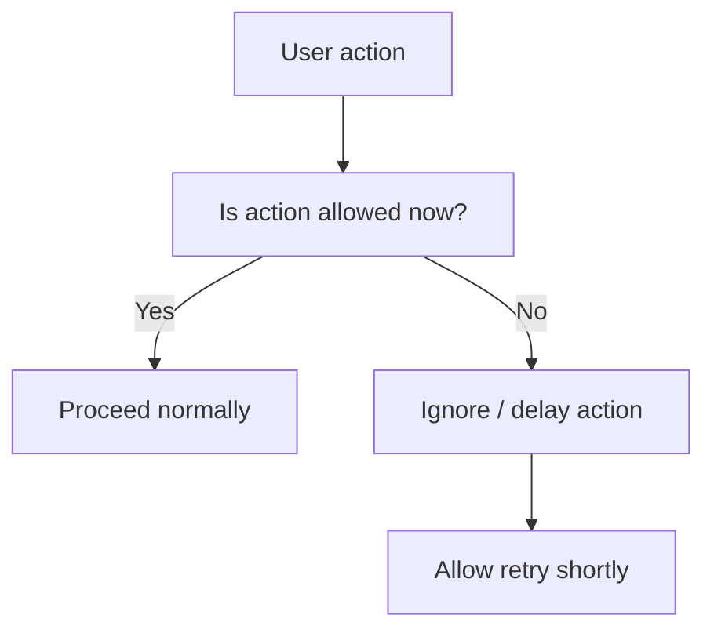

# Auth & Onboarding — Anti-bot & Anti-abuse Rules (Vietnam-first)

**Document type**: Anti-abuse Specification (MANDATORY APPENDIX)  
**Audience**: Frontend engineers + AI coding agents  
**Target users**: Vietnamese students (non-technical)  
**Threat model**: Light abuse, spam clicks, automation scripts, bypass attempts  
**Explicit constraint**: ❌ NO CAPTCHA, ❌ NO friction-heavy security

This document defines:
- What counts as abuse
- How UI must react safely
- How to block abuse without harming UX
- How to fail gracefully

This document **OVERRIDES permissive interaction behavior**.

---

## 1) Anti-abuse Philosophy

1. **Protect UX first**
   - Never punish normal users
   - Never add cognitive load

2. **Block patterns, not people**
   - Detect behavior patterns, not identity

3. **Invisible defense**
   - Prefer silent blocking over scary warnings

4. **Retry-friendly**
   - Always allow recovery after a short delay

---

## 2) Login Entry — Abuse Scenarios

### 2.1 Rapid Click Spam (Google CTA)

#### AB-LOGIN-01

**Given**
- User is unauthenticated
- Login entry screen is visible

**When**
- User clicks “Continue with Google” more than once rapidly
- OR script triggers multiple clicks in < 500ms

**Then**
- Disable CTA immediately on first click
- Ignore all subsequent clicks
- Allow only ONE OAuth popup

**UI Response**
- No error shown
- Button shows loading spinner

---

### 2.2 OAuth Popup Abuse

#### AB-LOGIN-02

**Given**
- OAuth popup opened

**When**
- User repeatedly cancels OAuth (≥ 3 times in short session)

**Then**
- Still allow retry
- BUT add small delay (e.g. 1–2 seconds) before re-enabling CTA

**UI Response**
```
Please try again.
```

(no mention of abuse)

---

## 3) Birthday Screen — Abuse & Tampering

### 3.1 Input Flood / Script Injection (Client-side)

#### AB-BDAY-01

**Given**
- Birthday screen is visible

**When**
- Script attempts to inject non-numeric or malformed values into dropdown state

**Then**
- UI must reject values
- Fallback to last valid selection
- No error shown unless user clicks Continue

---

### 3.2 Continue Button Spam

#### AB-BDAY-02

**Given**
- Birthday inputs are invalid

**When**
- User repeatedly clicks Continue rapidly

**Then**
- Validation runs once per click cycle
- No duplicate error messages rendered
- Button remains disabled if invalid

---

### 3.3 Date Boundary Probing

#### AB-BDAY-03

**Given**
- User repeatedly changes year/month/day to probe validation edge cases

**When**
- User alternates between invalid and valid dates rapidly

**Then**
- UI must:
  - Always revalidate on Continue
  - Never auto-correct silently
  - Never crash or freeze

---

## 4) Role Selection — Abuse & Bypass Attempts

### 4.1 Client-side Role Manipulation

#### AB-ROLE-01

**Given**
- User age < 18

**When**
- User modifies client state (DevTools, script) to set role = teacher

**Then**
- On submit:
  - Ignore manipulated value
  - Force role = student
  - Continue onboarding without showing error

**Rationale**
- Do not educate user about bypass vector
- Do not break flow

---

### 4.2 Toggle Spam (Eligible Users)

#### AB-ROLE-02

**Given**
- User age ≥ 18
- Teacher option visible

**When**
- User toggles teacher checkbox rapidly

**Then**
- UI state updates normally
- Final state at submit time is authoritative
- No debounce needed unless performance issue detected

---

## 5) Profile Creation — Abuse Prevention

### 5.1 Double Submit / Multi-submit

#### AB-PROFILE-01

**Given**
- Profile confirmation screen is visible

**When**
- User clicks “Sign up” multiple times
- OR script triggers submit repeatedly

**Then**
- Disable button immediately on first click
- Ignore further submit attempts
- Only one network request allowed

---

### 5.2 Network Retry Abuse

#### AB-PROFILE-02

**Given**
- Profile creation failed due to network/server

**When**
- User retries submit repeatedly very fast

**Then**
- Allow retry
- BUT enforce minimal cooldown (e.g. 1 second)
- Preserve all user state

---

## 6) Resume Onboarding — Abuse Scenarios

### 6.1 Forced Resume Loop

#### AB-RESUME-01

**Given**
- onboardingStatus != complete

**When**
- User repeatedly logs in / logs out quickly

**Then**
- Resume onboarding correctly each time
- Do not duplicate user records
- Do not advance onboarding without validation

---

## 7) Global Rate-limiting (UI-level, Light)

### 7.1 Scope

Rate-limiting applies only to:
- OAuth initiation
- Profile creation submit

### 7.2 Rules

#### AB-RATE-01

**Given**
- Same action triggered repeatedly in very short time

**Then**
- Add small UI delay (500ms–2000ms)
- Do NOT show “too many requests”
- Do NOT lock user out

---

## 8) Anti-abuse Flow Summary



---

## 9) Explicit Don’ts

- ❌ No CAPTCHA
- ❌ No scary warnings
- ❌ No permanent lockout
- ❌ No revealing abuse detection logic

---

## 10) Required Test Scenarios (Anti-abuse)

- [ ] Rapid click spam on Google login
- [ ] OAuth cancel retry loop
- [ ] Birthday input tampering
- [ ] Role manipulation via DevTools
- [ ] Double submit on Sign up
- [ ] Resume login/logout spam

---

**END OF ANTI-BOT & ANTI-ABUSE SPEC (VN)**
