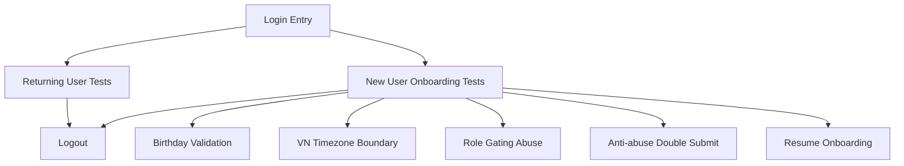

# Auth & First-time Onboarding — Playwright E2E Test Specification

**Document type**: E2E Test Requirement (MANDATORY APPENDIX)  
**Audience**: Frontend engineers + AI coding agents  
**Framework**: Playwright  
**Scope**: Google login/signup + onboarding + VN timezone + validation + anti-abuse  
**Non-goal**: Unit testing details (separate); this doc is E2E-only.

**Important**
- These tests are **required** for feature completeness.
- If an app environment cannot use real Google OAuth, tests MUST use a deterministic mock/stub strategy.

---

## 0) Test Strategy

### 0.1 What E2E must prove
1. Returning user skips onboarding
2. New user must complete birthday + role gating + profile creation
3. Validation blocks progress (missing/invalid/future dates)
4. VN timezone governs age and teacher gating
5. Anti-abuse rules work (double click / double submit / rapid retry)
6. Resume onboarding works without data loss
7. Logout clears session and blocks protected pages

---

## 1) Required Test Environment Hooks

### 1.1 Deterministic Auth Mode (Mandatory for CI)

**Requirement**
- App must support one of these E2E modes:

Option A (preferred): **Mock OAuth route**
- `/__e2e__/auth/google?user=<fixtureId>`
- Returns deterministic identity (googleSub/email/name/avatar)
- App treats it as OAuth success

Option B: **Service worker / Playwright route interception**
- Intercept OAuth callback and inject identity payload

Option C: **Feature flag**
- `E2E_AUTH_MODE=true` switches Google button into a stub login picker

**Tests MUST NOT depend on real Google UI** in CI.

---

### 1.2 Deterministic Backend / Repository

**Requirement**
- Provide an E2E reset endpoint OR fixture-based DB state:
  - `POST /__e2e__/reset`
  - or seed scripts
- Must support:
  - create returning user fixture
  - create incomplete onboarding fixture
  - clear sessions

---

### 1.3 VN Time Control

**Requirement**
- Test environment must allow control over “now” to simulate VN timezone boundary.
- Acceptable approaches:
  - Mock time in app with `E2E_NOW_ISO=...`
  - Or a server-provided `/__e2e__/time` endpoint
  - Or Playwright `page.addInitScript()` with time override (only if app uses Date safely)

**All age gating tests require VN-local time control**.

---

## 2) User Fixtures

### 2.1 Fixture identities
- `U_RETURNING_1`: existing user, onboarding complete
- `U_NEW_1`: new user, does not exist in repository
- `U_INCOMPLETE_BDAY`: user exists, onboardingStatus != complete (birthday already stored)
- `U_INCOMPLETE_NONE`: user exists, onboardingStatus != complete (no birthday)

### 2.2 Standard fixture fields
- googleSub
- email
- fullName
- avatarUrl

---

## 3) Smoke Tests (Critical)

### T-SMOKE-01: Landing shows Google login CTA
**Given** user not logged in  
**When** open Landing/Auth entry  
**Then** show button “Continue with Google”  
**And** no email/password fields exist  

---

### T-SMOKE-02: Logout clears session
**Given** user logged in  
**When** click “Log out”  
**Then** session cleared  
**And** redirected to landing  
**And** protected page redirects back to login  

---

## 4) Returning User Flow (Login by Google)

### T-RET-01: Returning user skips onboarding
**Given** repo contains `U_RETURNING_1` and onboardingStatus=complete  
**When** user clicks “Continue with Google” and completes mock OAuth as `U_RETURNING_1`  
**Then** user is redirected to Home (or returnTo)  
**And** birthday screen is NOT shown  
**And** role selection is NOT shown  

---

### T-RET-02: returnTo redirect works
**Given** user is unauthenticated  
**When** open protected page `/sets` (or any protected route)  
**Then** redirected to login with returnTo  
**When** login succeeds as `U_RETURNING_1`  
**Then** redirected back to `/sets`  

---

## 5) New User Flow (Signup by Google)

### T-NEW-01: New user onboarding — happy path (age < 18)
**Given** `U_NEW_1` does not exist  
**And** VN time is set to `2026-01-18T10:00:00+07:00`  
**When** login as `U_NEW_1`  
**Then** birthday screen shown  
**When** select birthday resulting in age 17  
**Then** proceed to role step  
**And** teacher option is hidden  
**When** proceed to profile confirm and click “Sign up”  
**Then** onboarding complete  
**And** redirected to Home  

---

### T-NEW-02: New user onboarding — happy path (age >= 18, teacher visible)
**Given** `U_NEW_1` does not exist  
**And** VN time is set to `2026-01-18T10:00:00+07:00`  
**When** login as `U_NEW_1`  
**Then** birthday screen shown  
**When** select birthday resulting in age 18  
**Then** teacher option visible  
**When** check “I’m a teacher”  
**And** click “Sign up”  
**Then** created user role = teacher  
**And** redirected to Home  

---

## 6) Birthday Validation Tests (Fail / Pass)

### T-BDAY-01: Missing fields blocks Continue
**Given** birthday screen shown  
**When** click Continue without selecting month/day/year  
**Then** show inline error “Please select your birthday.”  
**And** remain on birthday screen  

---

### T-BDAY-02: Invalid calendar date blocked
**Given** birthday screen shown  
**When** select Feb 30, 2005  
**And** click Continue  
**Then** show “That doesn’t look like a real date.”  
**And** remain on birthday screen  

---

### T-BDAY-03: Future date blocked using VN_TODAY
**Given** VN time is `2026-01-18T10:00:00+07:00`  
**When** select birthday `2026-01-19`  
**And** click Continue  
**Then** show “Your birthday can’t be in the future.”  
**And** remain on birthday screen  

---

### T-BDAY-04: Valid date passes
**Given** birthday screen shown  
**When** select a valid past birthday  
**And** click Continue  
**Then** proceed to next step  
**And** error cleared  

---

## 7) VN Timezone & Midnight Boundary Tests

### T-TZ-01: Browser timezone mismatch does not affect gating
**Given** browser is forced to a non-VN timezone (if feasible)  
**And** VN time is controlled to `2026-01-18T10:00:00+07:00`  
**When** user selects birthday to make age 18 in VN  
**Then** teacher option visible regardless of browser timezone  

---

### T-TZ-02: Crossing midnight changes eligibility
**Given** VN time is `2026-01-18T23:59:50+07:00`  
**And** user birthday makes them turn 18 on `2026-01-19`  
**When** user completes birthday step  
**Then** teacher option should be hidden (age 17)  
**When** advance step after VN time becomes `2026-01-19T00:00:10+07:00`  
**Then** eligibility must re-evaluate and teacher option becomes visible (age 18)  

---

## 8) Role Gating Abuse Tests

### T-ROLE-01: Under-18 cannot become teacher via UI
**Given** age < 18  
**When** role step shown  
**Then** teacher option not present in DOM  
**And** role remains student through signup  

---

### T-ROLE-02: Under-18 devtools manipulation ignored (E2E simulation)
**Given** age < 18  
**When** test injects JS to set local role state = teacher (if accessible)  
**And** user submits signup  
**Then** created role is student  
**And** onboarding completes normally  

> If the app architecture prevents injection, validate by asserting:
> - teacher control not rendered
> - submit payload / user record role = student

---

## 9) Anti-abuse Tests

### T-ABUSE-01: Login CTA double-click opens only one flow
**Given** login entry visible  
**When** click “Continue with Google” twice quickly  
**Then** only one OAuth initiation occurs  
**And** button disabled/loading  

---

### T-ABUSE-02: Sign up double submit sends one request
**Given** profile confirm screen  
**When** click “Sign up” multiple times quickly  
**Then** only one create-user request sent  
**And** button disabled during request  

---

### T-ABUSE-03: Retry cooldown on repeated failures (light)
**Given** create-user endpoint is forced to fail once  
**When** click “Sign up” and see failure  
**And** immediately click “Sign up” again rapidly  
**Then** app applies short delay (>= 500ms) before next request  
**And** UX remains friendly (no scary warning)  

---

## 10) Resume Onboarding Tests

### T-RESUME-01: Resume to birthday when none stored
**Given** user fixture `U_INCOMPLETE_NONE` exists  
**When** login as that user  
**Then** redirected to birthday step  

---

### T-RESUME-02: Resume to role/profile when birthday stored
**Given** user fixture `U_INCOMPLETE_BDAY` exists  
**When** login as that user  
**Then** birthday step is skipped  
**And** user resumes at role/profile step  

---

### T-RESUME-03: Resume re-evaluates age with new VN date
**Given** user birthday stored near boundary  
**And** VN date changes between sessions  
**When** resume onboarding next day  
**Then** teacher eligibility is recalculated correctly  

---

## 11) Mermaid — Test Coverage Map (Optional)

---

## 12) Deliverables Checklist (Blocking)

- [ ] Deterministic mock Google OAuth works in CI
- [ ] E2E reset/seed mechanism exists
- [ ] Time control mechanism exists (VN timezone)
- [ ] All tests above implemented and passing
- [ ] No test depends on real Google UI

---

**END OF PLAYWRIGHT E2E TEST SPEC**
