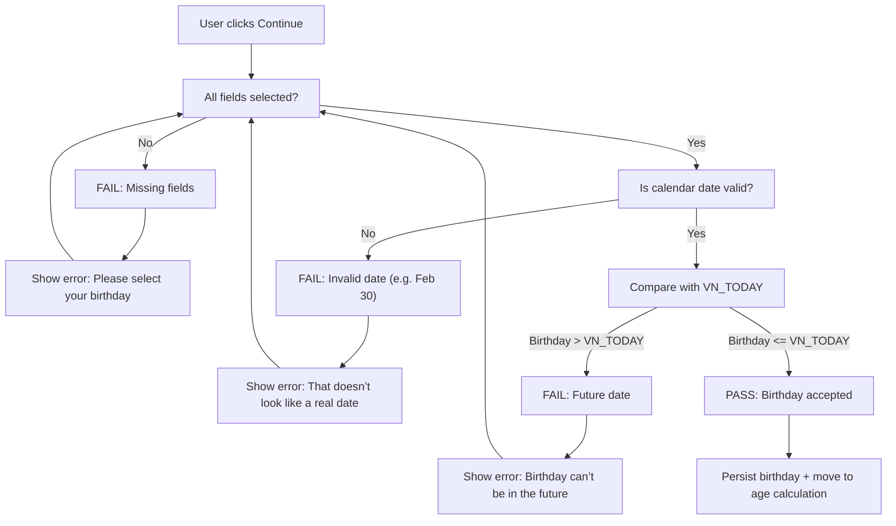
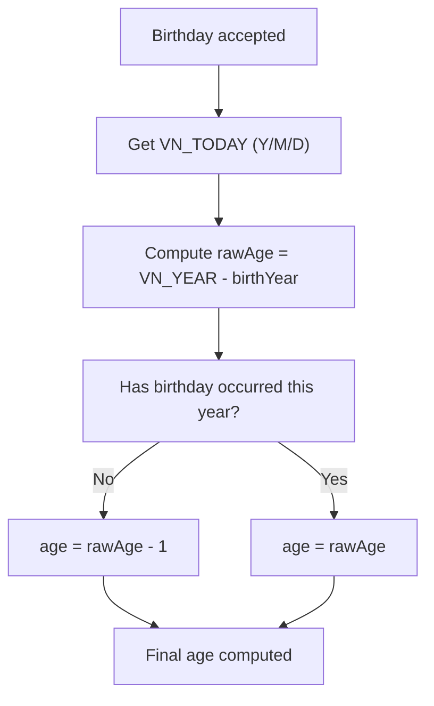
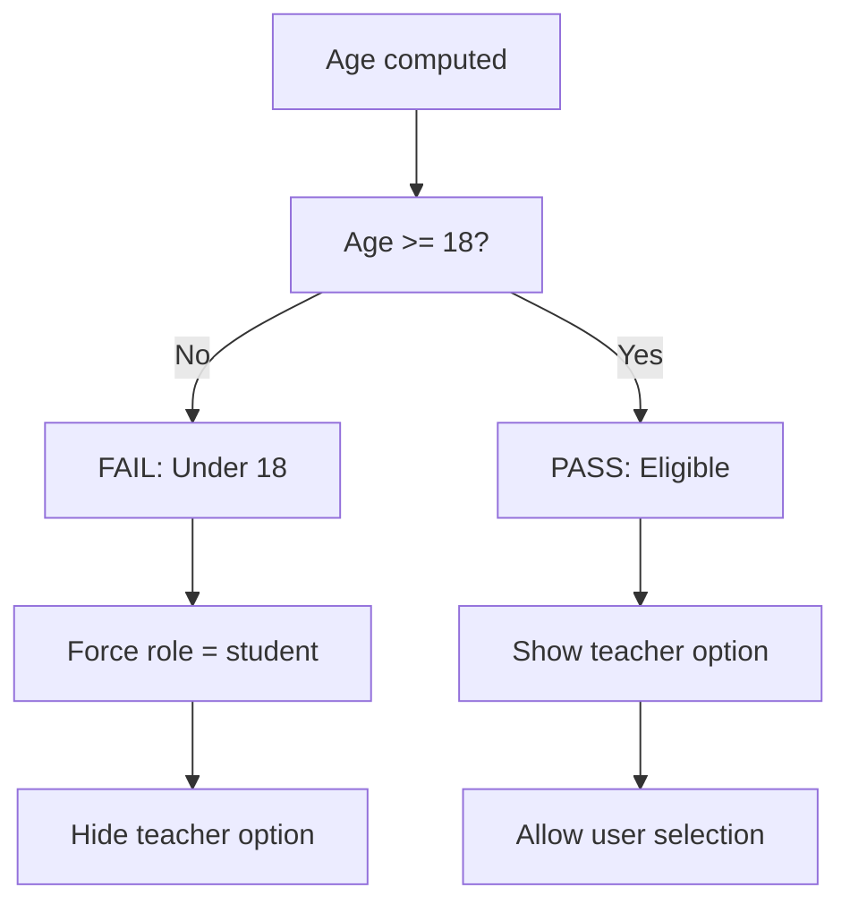
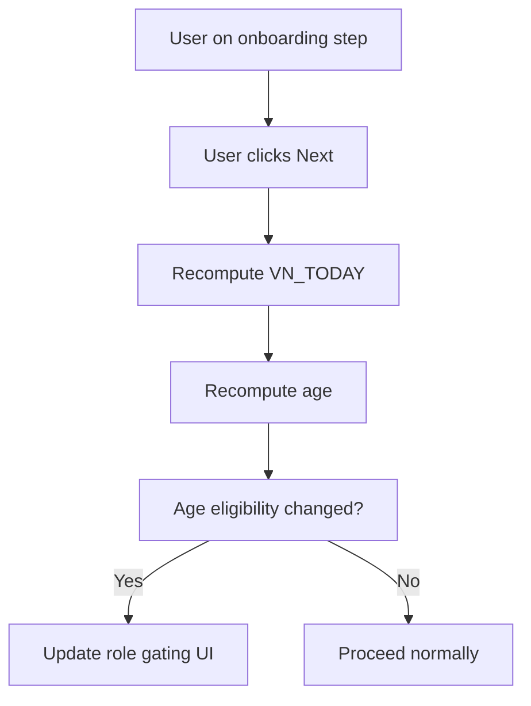
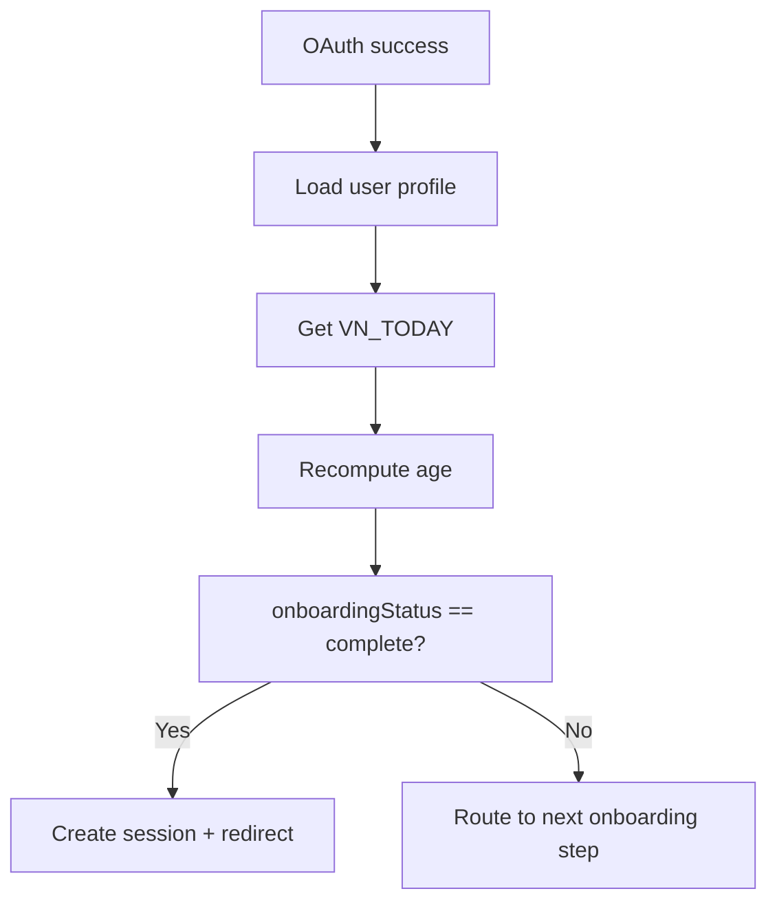

# Auth & Onboarding — Locale & Timezone Rules (Vietnam / Asia-Ho_Chi_Minh)

**Document type**: Locale + Timezone Specification (MANDATORY APPENDIX)  
**Audience**: Frontend engineers + AI coding agents  
**Market**: Vietnam (VN) only  
**Timezone**: `Asia/Ho_Chi_Minh` (UTC+7)  
**Primary purpose**: Ensure ALL age, birthday, and role-gating logic behaves identically for all Vietnamese users

This document defines:
- Single source of truth for date & time
- Detailed PASS / FAIL validation flows
- Midnight boundary behavior
- Resume & edge-case handling

This document **OVERRIDES any generic date/time logic**.

---

## 1) Single Source of Truth for “Today”

### TZ-01: VN local date is the ONLY truth

**Given**
- App needs to validate birthday
- OR compute age
- OR determine teacher eligibility

**When**
- “Today” is required

**Then**
- “Today” MUST be derived from `Asia/Ho_Chi_Minh`
- Browser timezone MUST NOT be used directly
- UTC date MUST NOT be used directly

---

### TZ-02: Mandatory helper abstraction

**Requirement**
- All code paths MUST use a shared helper:
  - Example:
    - `getVietnamNow()`
    - `getVietnamLocalDate() -> { year, month, day }`

**Anti-rule**
- ❌ No scattered `new Date()`
- ❌ No implicit browser timezone logic

---

## 2) Birthday Validation — FULL PASS / FAIL FLOW

### 2.1 Birthday Input Validation Flow

---

### 2.2 Detailed Validation Rules

#### DATE-FAIL-01: Missing fields
- **Given** any of Month / Day / Year missing
- **When** user clicks Continue
- **Then** block progress
- **And** show inline error
- **And** do NOT clear selected values

#### DATE-FAIL-02: Invalid calendar date
- **Given** selected date does not exist in Gregorian calendar
- **Then** block progress
- **And** show invalid-date error
- **Examples**
  - Feb 30
  - Apr 31
  - Feb 29 on non-leap year

#### DATE-FAIL-03: Future date
- **Given** selected birthday > VN_TODAY
- **Then** block progress
- **And** show future-date error

---

## 3) Age Calculation — FULL DECISION FLOW

### 3.1 Age Calculation Flow (VN-local)

---

### 3.2 Business Rules

#### AGE-PASS-01: Birthday today
- **Given** VN_TODAY == birthday
- **Then** birthday is considered occurred
- **And** age increments at 00:00 VN time

#### AGE-PASS-02: Before birthday
- **Given** VN_TODAY is before birthday (month/day)
- **Then** age = rawAge − 1

---

## 4) Teacher Eligibility — FULL GATING FLOW

### 4.1 Teacher Gating Flow

---

### 4.2 Business Rules

#### ROLE-FAIL-01: Under 18
- **Given** computed age < 18
- **Then**
  - Teacher option MUST NOT appear
  - Role MUST be `student`
  - Client-side manipulation MUST be ignored

#### ROLE-PASS-01: Eligible
- **Given** computed age ≥ 18
- **Then**
  - Teacher option visible
  - User may select teacher

---

## 5) Midnight Boundary — EDGE CASE FLOW (CRITICAL)

### 5.1 Crossing Midnight During Onboarding

---

### 5.2 Business Rules

#### MID-FAIL-01: Stale age
- **Given** age was computed before midnight
- **When** user proceeds after VN midnight
- **Then** age MUST be recomputed
- **And** teacher eligibility updated immediately

---

## 6) Resume Onboarding — Timezone-safe Flow

### 6.1 Resume Decision Flow

---

### 6.2 Resume Rules

#### RESUME-FAIL-01: Stale age on resume
- **Given** user resumes onboarding days later
- **Then** age MUST be recomputed
- **And** teacher eligibility may change

---

## 7) Browser Timezone Defense — FAIL CASES

### 7.1 Browser timezone mismatch

**Given**
- Browser timezone ≠ Asia/Ho_Chi_Minh

**When**
- User opens birthday screen or resumes onboarding

**Then**
- VN_TODAY must still reflect Vietnam date
- UI behavior must be identical to VN-based device

---

## 8) Required Test Matrix (Locale & Timezone)

| Case | Browser TZ | VN Time | Expected |
|----|----|----|----|
| TC-TZ-01 | UTC-8 | 10:00 VN | Age correct |
| TC-TZ-02 | UTC+9 | 23:59 VN | Under-18 |
| TC-TZ-03 | UTC+9 | 00:01 VN | Turns 18 |
| TC-TZ-04 | UTC | Resume next day | Re-eval age |

---

## 9) Absolute Anti-Rules

- ❌ Never trust browser timezone
- ❌ Never cache age across steps
- ❌ Never allow teacher role without VN age ≥ 18
- ❌ Never assume “today” from UTC

---

**END OF LOCALE & TIMEZONE SPEC (VN, FULL FLOW)**
