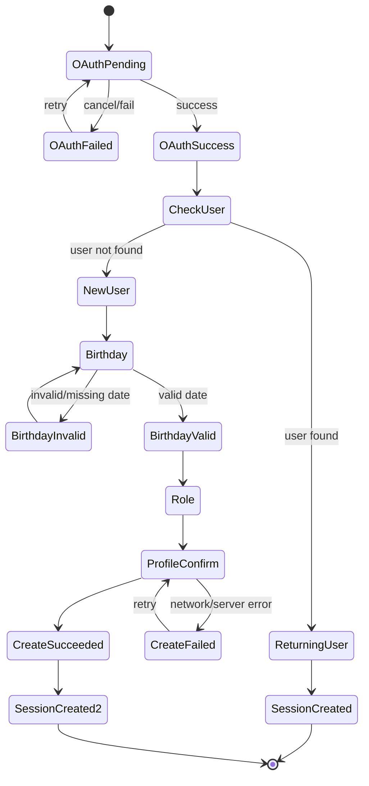
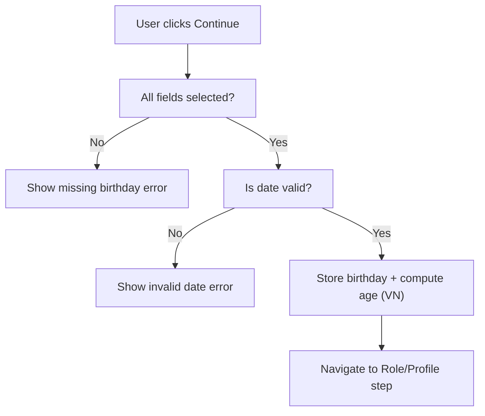
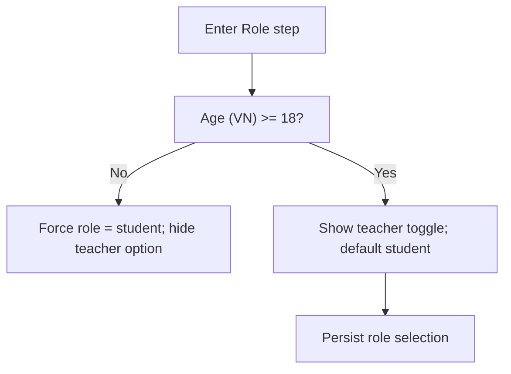
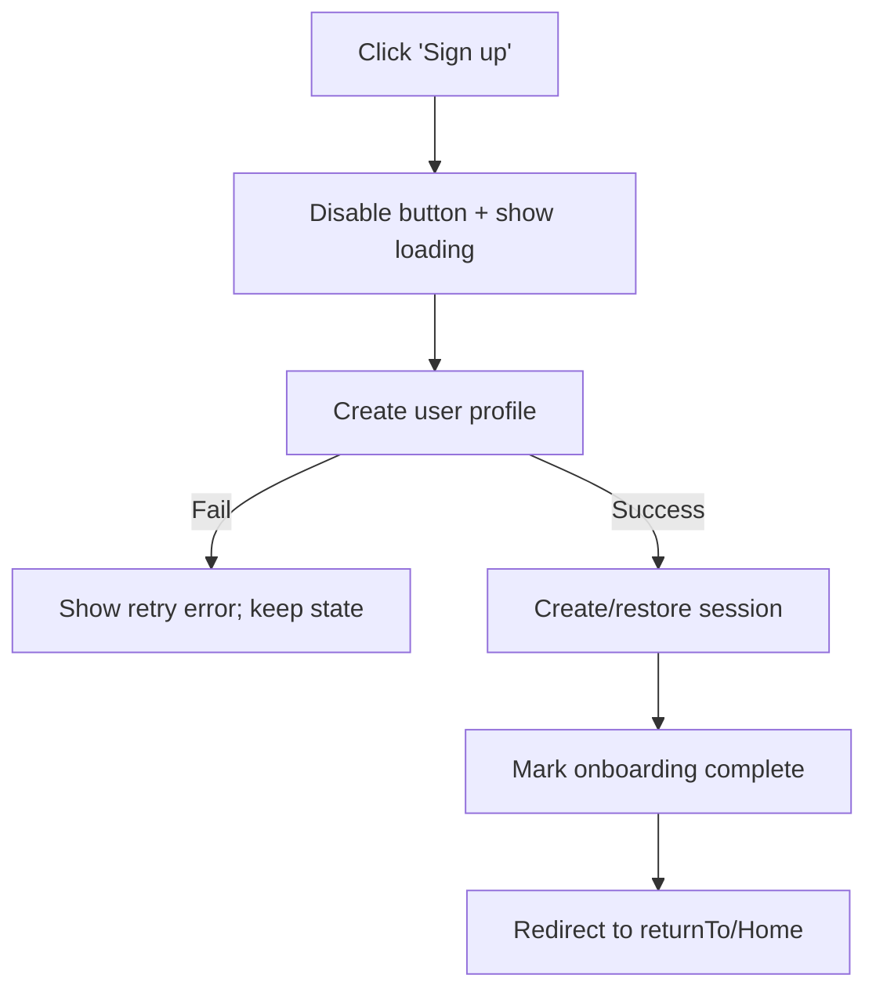
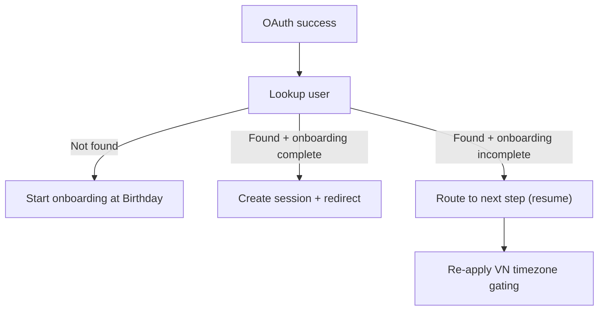

# Authentication & First-time Onboarding — Technical Requirement (Quizlet-like, Vietnam-first)

**Document type**: Primary technical requirement (Source of Truth)  
**Audience**: Frontend engineers + AI coding agents  
**Target users**: Vietnamese students (non-technical) + teachers  
**Auth methods in scope**: Google OAuth (Login + Signup)  
**Timezone**: Asia/Ho_Chi_Minh (UTC+7) for all age gating decisions  
**Language**: UI copy is defined in `auth-login-signup.copy-microinteraction.md` (exact strings). This doc defines flows, states, business rules, validation rules, and integration points.

---

## 0) Definitions

### 0.1 Terms
- **New user**: Google-authenticated identity not found in our user repository.
- **Returning user**: Google-authenticated identity already exists in our user repository.
- **Onboarding**: the first-time flow that collects birthday, derives age, and determines role.
- **Role**: `student` (default) or `teacher` (optional if age ≥ 18).
- **VN Local Date**: current date in `Asia/Ho_Chi_Minh` timezone (used for age gating).

### 0.2 Non-goals
- No email/password authentication.
- No social logins besides Google.
- No CAPTCHA (handled in appendix).
- No payments / upgrades in scope.

---

## 1) UX & Product Goals (must be reflected in implementation)

1. **Fast, low-friction onboarding**: Most users finish within 15–30 seconds.
2. **No jargon**: No “OAuth”, “delimiter”, “session token” displayed to users.
3. **Clear next step**: At every step, user knows what’s next.
4. **Strong validation**: User cannot proceed with invalid inputs; no silent failure.

---

## 2) Screens & Routes (reference model)

> You may implement screens as full pages or as a modal overlay depending on app structure. The state machine and transitions must remain identical.

### 2.1 Required screens (minimum)
- **Landing/Login entry**: CTA `Continue with Google`
- **Birthday collection** (first-time only)
- **Role selection** (embedded in onboarding; teacher option gated)
- **Account creation / completion** (first-time only; includes username auto-generation, “Sign up” submit)
- **Home** (post-login)
- **Profile menu** (available after login)
- **Logout** (action)

### 2.2 Suggested routes (example)
- `/` (landing or home)
- `/auth` (login entry, optional)
- `/onboarding/birthday`
- `/onboarding/profile`

---

## 3) Data Model (frontend-facing contract)

### 3.1 Auth identity (from Google)
- `googleSub: string` (stable unique identifier)
- `email: string`
- `emailVerified: boolean`
- `fullName?: string`
- `avatarUrl?: string`

### 3.2 User profile (stored in repository)
- `id: string`
- `googleSub: string`
- `email: string`
- `displayName: string`
- `username: string` (auto-generated at onboarding)
- `birthday: { year: number; month: number; day: number }`
- `role: "student" | "teacher"`
- `createdAt: string` (ISO)
- `onboardingStatus: "complete" | "birthday_done" | "profile_pending"` (or equivalent)

### 3.3 Session (frontend)
- `sessionId` or `accessToken` (implementation-specific)
- Must support:
  - `isAuthenticated`
  - retrieving current user profile
  - logout / clear session

---

## 4) Core Flow Summary

### 4.1 Global navigation flow
```mermaid
flowchart TD
  A["Unauthenticated user"] --> B["Landing/Login entry"]
  B -->|Click 'Continue with Google'| C["Google OAuth"]
  C -->|OAuth success| D["Lookup user by googleSub"]
  C -->|OAuth failed/cancel| B

  D -->|Found (Returning user)| E["Create/restore session"]
  D -->|Not found (New user)| F["Start onboarding: Birthday"]

  E --> G["Redirect to returnTo or Home"]

  F --> H["Birthday validation + store birthday"]
  H --> I["Compute age (Asia/Ho_Chi_Minh)"]
  I --> J["Role selection (teacher gated)"]
  J --> K["Auto-generate username + confirm signup"]
  K -->|Success| E
  K -->|Fail| J
```

---

## 5) Login with Google (Returning User)

### 5.1 Business rules

#### BR-LG-01: Google-only login entry
- **Given** user is unauthenticated  
- **When** login UI is shown  
- **Then** the only primary CTA is Google login  
- **And** no email/password fields exist  

#### BR-LG-02: Returning user bypasses onboarding
- **Given** user exists in repository  
- **When** Google OAuth succeeds  
- **Then** create/restore session and redirect  
- **And** must NOT show birthday/role onboarding  

#### BR-LG-03: Redirect after login
- **Given** `returnTo` exists  
- **When** login completes  
- **Then** redirect to `returnTo`  
- **Else** redirect to Home  

### 5.2 Validation rules
- Disable the Google CTA while OAuth is in progress (prevents double open).
- On OAuth failure/cancel: show friendly error and allow retry (exact copy in copy appendix).

---

## 6) Signup with Google (New User) — First-time Onboarding

### 6.1 Onboarding state machine (detailed)


---

## 7) Birthday Screen (First-time only)

### 7.1 UI requirements (logic-level)
- Inputs: Month dropdown, Day dropdown, Year dropdown
- Continue is disabled until all fields selected
- All age calculations MUST use Asia/Ho_Chi_Minh (details in locale appendix)

### 7.2 Business rules (Given/When/Then)

#### BR-BD-01: Birthday required
- **Given** user is a new user  
- **When** they arrive at onboarding  
- **Then** birthday screen must appear before any profile is created  

#### BR-BD-02: Required fields
- **Given** birthday screen is visible  
- **When** user clicks Continue with any missing field  
- **Then** block Continue and show inline error  

#### BR-BD-03: Date validity
- **Given** user selects month/day/year  
- **When** chosen date is not a valid calendar date  
- **Then** block Continue and show inline error  

#### BR-BD-04: Compute age in VN timezone
- **Given** birthday is valid  
- **When** user continues  
- **Then** compute age using **VN local date**  
- **And** do not depend on UTC boundary or non-VN browser timezones  

#### BR-BD-05: Persist onboarding progress
- **Given** birthday validation passes  
- **Then** onboarding status must move forward so user can resume later  

### 7.3 Birthday validation flow (UI-level)


### 7.4 Validation rules
- Month/day/year required
- Invalid dates rejected (e.g., Feb 30)
- Year must be:
  - ≤ current VN year
  - ≥ 1900 (consistent across code + tests)
- Future dates invalid

---

## 8) Role Selection (Student default; Teacher gated)

### 8.1 Display conditions
- If age < 18 (VN local): teacher option must NOT be selectable (prefer hidden).
- If age ≥ 18: show teacher checkbox (exact copy in copy appendix).

### 8.2 Business rules

#### BR-ROLE-01: Default role is student
- **Given** role selection is available  
- **Then** role defaults to `student`  

#### BR-ROLE-02: Teacher gating
- **Given** computed age < 18  
- **Then** teacher option is hidden (or disabled with no interaction)  
- **And** role must remain `student` even if user manipulates UI state  

#### BR-ROLE-03: Teacher selection
- **Given** age ≥ 18 and teacher option visible  
- **When** user checks teacher checkbox  
- **Then** role becomes `teacher` and persists for profile creation  

#### BR-ROLE-04: No extra confirmation
- **Given** user toggles teacher checkbox  
- **Then** no modal confirmation is shown  

### 8.3 Role gating flow


---

## 9) Username Auto-generation & Profile Completion (First-time)

### 9.1 Username requirements
- Auto-generated (read-only on onboarding screen)
- Must be unique
- Suggested pattern: `{Adjective}{Animal}{5 digits}` (deterministic + testable)

### 9.2 Business rules

#### BR-USER-01: Username auto-generated
- **Given** new user reaches profile step  
- **Then** username is generated automatically and displayed  

#### BR-USER-02: Uniqueness
- **Given** generated username conflicts  
- **Then** regenerate until unique (bounded retries, e.g., max 10)  
- **And** on repeated failure show friendly error (copy in appendix)  

#### BR-USER-03: Editable later
- **Given** user is onboarding  
- **Then** username is read-only here (editable in Settings later; not in scope)  

---

## 10) Create Profile + Create Session (Atomic)

### 10.1 Atomicity requirement
Profile creation and session creation must be treated as one logical completion. If profile creation fails, onboarding remains incomplete.

### 10.2 Business rules

#### BR-CRT-01: Create profile only after birthday validated
- **Given** birthday invalid  
- **Then** no user record is created  

#### BR-CRT-02: Submit handling
- **Given** user clicks “Sign up”  
- **Then** disable submit immediately and show loading state  
- **And** prevent double submit  

#### BR-CRT-03: On success
- **Given** profile created successfully  
- **Then** create session and mark onboardingStatus = `complete`  
- **And** redirect to returnTo/home  

#### BR-CRT-04: On failure
- **Given** profile creation fails (network/server)  
- **Then** show friendly error and allow retry  
- **And** preserve birthday/role selections  

### 10.3 Submit flow


---

## 11) Resume Onboarding (Interrupted flows)

### 11.1 Requirements
If a user logs in again with the same Google identity and their onboarding is not complete, the app must resume at the correct step.

### 11.2 Business rules

#### BR-RSM-01: Resume point
- **Given** user record exists but onboardingStatus != complete  
- **When** user logs in  
- **Then** redirect to the next required onboarding step  

#### BR-RSM-02: Birthday already collected
- **Given** onboardingStatus indicates birthday stored  
- **Then** skip birthday screen  

#### BR-RSM-03: Recalculate age boundary
- **Given** resume occurs on a different VN local date (e.g., after midnight)  
- **Then** recompute age gating and teacher option visibility  

### 11.3 Resume flow


---

## 12) Profile Menu (Logged-in UI shell)

### 12.1 Must-have behaviors
- Show avatar (Google photo or fallback)
- Show username + email
- Include Logout action

### 12.2 Business rules
- Logout clears session and returns to landing.
- After logout, protected pages require login again.

---

## 13) Error Handling (User-friendly)

### 13.1 OAuth failure
- Show friendly error and Retry.
- No technical codes displayed.

### 13.2 Network errors
- Profile creation failure shows a retry message and keeps user on same step.

---

## 14) Accessibility (baseline)

- Keyboard navigation for dropdowns
- Visible focus outlines
- Buttons have disabled states
- Errors associated with inputs (aria-describedby recommended)

---

## 15) Test Coverage (high level)

Concrete E2E coverage is defined in `auth-login-signup.e2e-playwright.md`.

At minimum, tests must cover:
- Returning user login (skip onboarding)
- New user signup (birthday → role → create)
- Teacher age gating (VN time)
- Resume onboarding
- Logout

---

## 16) Implementation Notes (non-binding)

- Keep onboarding state in a dedicated store (state machine recommended)
- Centralize VN time with `getNowInVietnam()`
- Avoid scattered `new Date()` calls

---

**End of primary requirement**
