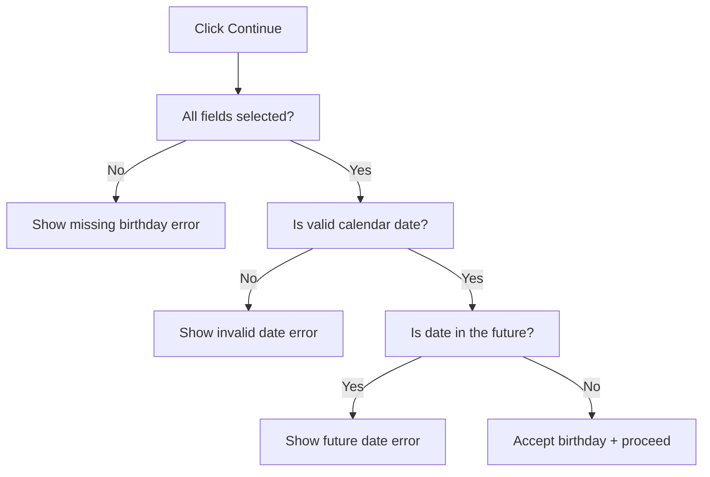
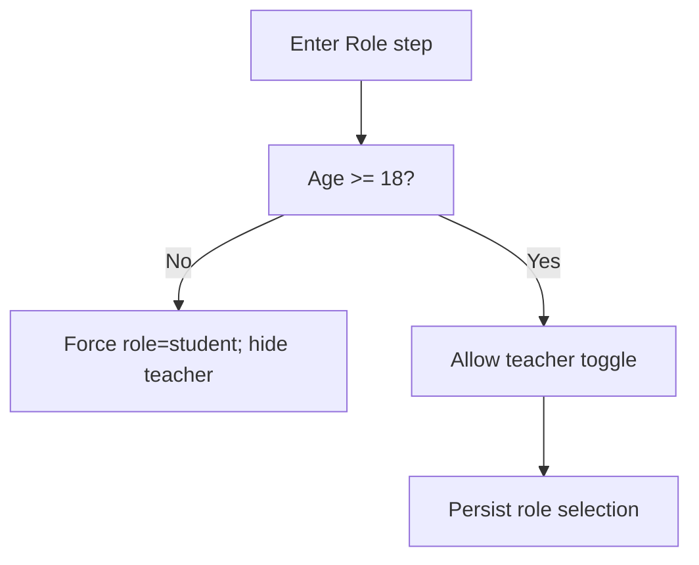
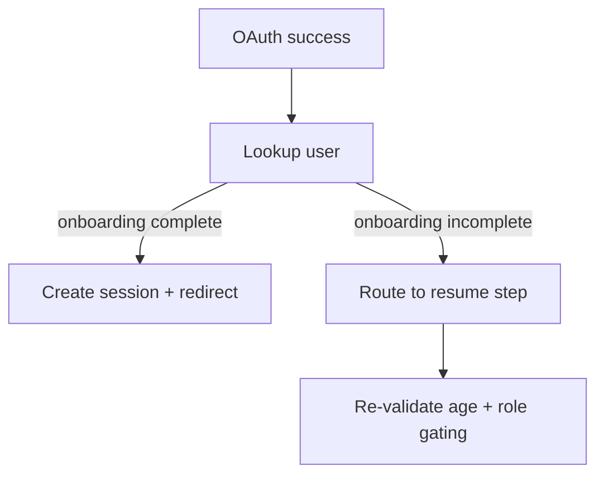

# Auth & First-time Onboarding — Validation & Anti-break Flow

**Document type**: Validation + Anti-break Specification (MANDATORY APPENDIX)  
**Audience**: Frontend engineers + AI coding agents  
**Target users**: Vietnamese students (non-technical)  
**Goal**: Prevent invalid input, broken states, bypass attempts, and silent failures  
**Priority**: UX-safe > Security-hard (no CAPTCHA)

This document defines:
- What inputs must be validated
- How UI reacts to invalid or abusive behavior
- How to prevent bypassing onboarding logic
- What happens when user tries to “break” the flow

This document **OVERRIDES permissive logic**.

---

## 1) Validation Philosophy

1. **Fail early, fail gently**
   - Block invalid actions immediately
   - Explain clearly what user needs to fix

2. **No silent failure**
   - Every blocked action must give feedback

3. **Preserve user effort**
   - Never reset valid input because of one invalid field

4. **UI validation first**
   - Backend validation still required, but UI must guide user before submit

---

## 2) Login Entry Validation

### 2.1 Double-click / Spam click (Google CTA)

**Given**
- User is unauthenticated
- Login entry is visible

**When**
- User clicks “Continue with Google” multiple times rapidly

**Then**
- Button becomes disabled immediately on first click
- Additional clicks have no effect
- Only one OAuth popup may open

---

### 2.2 OAuth Cancel / Failure

**Given**
- OAuth popup opened

**When**
- User closes popup or OAuth fails

**Then**
- User remains on login entry screen
- Show friendly inline error (copy from File 3)
- Allow retry immediately

---

## 3) Birthday Screen — Validation Rules

### 3.1 Missing Field Validation

**Given**
- Birthday screen is visible

**When**
- User clicks Continue
- AND one or more of Month / Day / Year is missing

**Then**
- Block Continue
- Show inline error: “Please select your birthday.”
- Do NOT clear selected fields

---

### 3.2 Invalid Calendar Date

**Given**
- User selected Month, Day, Year

**When**
- Selected combination is not a valid date (e.g., Feb 30)

**Then**
- Block Continue
- Show inline error: “That doesn’t look like a real date.”
- Preserve all dropdown selections

---

### 3.3 Future Date

**Given**
- User selected a valid calendar date

**When**
- Date is later than current VN local date

**Then**
- Block Continue
- Show inline error: “Your birthday can’t be in the future.”

---

### 3.4 Year Boundary Validation

**Given**
- User selects Year

**When**
- Year < 1900

**Then**
- Block Continue
- Show invalid date error

**When**
- Year > current VN year

**Then**
- Block Continue
- Show future date error

---

### 3.5 Birthday Validation Flow

---

## 4) Age Calculation & Gating Validation

### 4.1 Timezone Enforcement

**Given**
- Birthday is valid

**When**
- Age is calculated

**Then**
- Age MUST be calculated using Asia/Ho_Chi_Minh timezone
- Browser timezone MUST NOT affect result

---

### 4.2 Midnight Boundary Edge Case

**Given**
- User completes birthday step close to midnight VN time

**When**
- Date changes while user is onboarding

**Then**
- Age must be recalculated on next step
- Teacher eligibility may change accordingly

---

## 5) Role Selection — Anti-bypass Rules

### 5.1 Teacher Option Hidden (Age < 18)

**Given**
- User age < 18

**When**
- Role selection screen renders

**Then**
- Teacher option is NOT rendered in DOM
- Role is forced to `student`

---

### 5.2 UI Manipulation Attempt

**Given**
- User age < 18

**When**
- User manipulates client state (e.g., devtools) to set role = teacher

**Then**
- On submit:
  - Role is overridden back to `student`
  - No error shown to user
  - Continue onboarding safely

---

### 5.3 Role Validation Flow

---

## 6) Profile Creation — Submit Validation

### 6.1 Double Submit Prevention

**Given**
- Profile confirmation screen is visible

**When**
- User clicks “Sign up”

**Then**
- Disable button immediately
- Show loading spinner
- Ignore further clicks

---

### 6.2 Backend Failure

**Given**
- Submit request sent

**When**
- Backend returns error or network fails

**Then**
- Show inline error (copy from File 3)
- Re-enable button
- Preserve all input state

---

### 6.3 Partial Creation Protection

**Given**
- Profile creation succeeds
- But session creation fails

**Then**
- Treat onboarding as incomplete
- On next login, resume onboarding safely

---

## 7) Resume Onboarding — Validation

### 7.1 Resume Point Accuracy

**Given**
- User logs in
- onboardingStatus != complete

**When**
- App determines resume step

**Then**
- Resume at earliest incomplete step
- Do NOT skip required steps

---

### 7.2 Resume Flow

---

## 8) Global Anti-break Rules

1. Never allow navigation to Home until onboarding complete
2. Never trust client-only role value
3. Never clear valid input on validation failure
4. Never show technical error messages to user

---

## 9) Validation Checklist (for Testing)

- [ ] Missing birthday fields blocked
- [ ] Invalid calendar date blocked
- [ ] Future date blocked
- [ ] Age recalculated at midnight VN
- [ ] Teacher role blocked for <18
- [ ] Devtools role manipulation ignored
- [ ] Double submit prevented
- [ ] Resume onboarding works correctly

---

**END OF VALIDATION & ANTI-BREAK SPEC**
