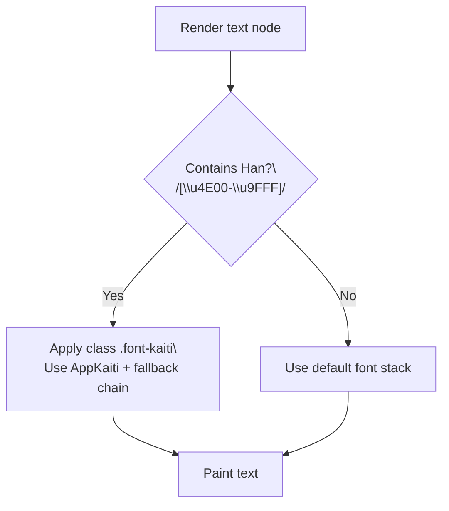
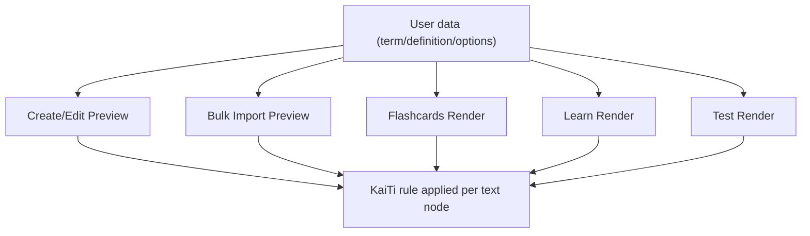

# KaiTi Chinese Font Support v1 (VN-first)

**Version**: v1  
**Type**: Technical Requirement (UI typography + rendering behavior)  
**Doc language**: English  
**UI copy/labels**: Vietnamese-only (only where new UI copy is needed; ideally none)  
**Goal**: Support “KaiTi / Kaiti Chinese font” rendering for Chinese (Han/CJK) characters across the Quizlet-clone: **input/preview**, **Flashcards**, **Learn**, and **Test**.

---

## 1) Scope

### 1.1 In Scope
- Render any text containing **Han (Chinese) characters** using a KaiTi-like font.
- Apply this behavior consistently in:
  - **Create/Edit Set** (Term/Definition fields + preview blocks)
  - **Bulk Import** (textarea preview + saved card preview)
  - **Flashcards** study mode
  - **Learn** study mode (MCQ/Multi-select/Written prompts, options, feedback)
  - **Test** study mode (question prompt, options, user answer review, results)

### 1.2 Out of Scope
- Detecting language beyond “Han characters present”.
- Allowing users to pick fonts or change typography settings (no UI setting for font selection in v1).
- Full localization changes (this is typography-only).

---

## 2) UX Principles (VN student-friendly)
- No extra settings required: **auto-apply** when Chinese characters are present.
- No surprise typography on non-Chinese text.
- Must remain readable and visually stable across devices:
  - If KaiTi is unavailable, fallback gracefully to common CJK fonts.

---

## 3) Detection Rule (When to apply KaiTi)

### 3.1 Han character detection
A string is considered “Chinese text” if it contains at least one character in the CJK Unified Ideographs basic block:

- Regex: `/[\u4E00-\u9FFF]/`

### 3.2 Granularity
- Apply KaiTi **per text node**:
  - Each Term, Definition, Option label, Feedback answer line should be evaluated independently.
- Do not apply KaiTi to the whole page.

---

## 4) Font Strategy

### 4.1 Preferred strategy (portable)
To ensure KaiTi rendering is consistent across machines:
- Bundle a **WOFF2 KaiTi-compatible font** in the repo and load via `@font-face`.

**Required characteristics:**
- Format: `.woff2` preferred
- Font-family name (internal): `AppKaiti` (recommended)
- Must include basic CJK glyphs needed for typical Chinese learning sets.

> Note: If font licensing/size is a concern, implement fallback-only (4.2) and document it.

### 4.2 Fallback strategy (system fonts)
If bundling is not possible:
- Use a font-family fallback chain:
  - `"KaiTi"`, `"KaiTi_GB2312"`, `"STKaiti"`, `"Kaiti SC"`, `"Kaiti TC"`, serif
- This may vary by OS, but preserves intent.

### 4.3 CSS class contract
Define a single CSS class used everywhere:
- `.font-kaiti`

Behavior:
- For Han-containing strings: apply `.font-kaiti`
- Else: use existing font stack unchanged

---

## 5) Where to Apply (UI Inventory)

### 5.1 Create/Edit Set
**Must apply to:**
- Term input (as user types) OR at least the Term preview block
- Definition input OR at least the Definition preview block
- Card list preview rows

**Recommendation:**
- If styling input text is hard due to component constraints, ensure preview blocks show correct font (minimum acceptable UX).

### 5.2 Bulk Import
**Must apply to:**
- Preview cards list (post-parse)
- Term/Definition preview cells
- Any “parsed output” section

### 5.3 Flashcards Mode
**Must apply to:**
- Card face text (Term or Definition)
- Any small preview list/mini card text (if shown)

### 5.4 Learn Mode
**Must apply to:**
- Prompt text (Term / Definition depending on mode)
- All option labels (MCQ and Multi-select)
- Feedback correct answer display line:
  - e.g. “Đáp án đúng là: {answer}”
- Progress header does NOT need KaiTi (unless it contains Han, which is unlikely)

### 5.5 Test Mode
**Must apply to:**
- Question prompt
- Options list
- Results review pages (correct answer lines, user answer lines)

---

## 6) Business Rules (Given/When/Then)

### BR-KT-001 (Detection)
Given a text string is rendered in any study UI  
When the string contains at least one Han character (`/[\u4E00-\u9FFF]/`)  
Then render the string using `.font-kaiti`

### BR-KT-002 (Non-Chinese)
Given a text string contains no Han character  
Then render using the default UI font stack (no `.font-kaiti`)

### BR-KT-010 (Input/Preview consistency)
Given a user enters Term/Definition with Han characters  
When the preview block renders  
Then the preview must use `.font-kaiti` for that field

### BR-KT-020 (Option labels)
Given a Learn/Test option label contains Han characters  
Then that option label must use `.font-kaiti`

### BR-KT-030 (Feedback)
Given feedback shows the correct answer text and it contains Han characters  
Then the correct answer portion must use `.font-kaiti`

### BR-KT-040 (Fallback)
Given the preferred KaiTi font is not available on the device  
Then the UI must fallback to the defined fallback chain without layout breaking

---

## 7) Validation Rules & Edge Cases

### VR-KT-001 (Mixed scripts)
If a string contains both Latin and Han characters:
- Apply `.font-kaiti` to the entire string (v1 simple rule).
- Must not break line-height or overflow.

### VR-KT-002 (Long text)
Long Chinese strings must:
- Wrap within container
- Not overflow buttons or actions
- Not cause layout shift between question types

### VR-KT-003 (Emoji / punctuation)
Emoji and punctuation can coexist with Han:
- Must still render; punctuation matching remains unchanged.

### VR-KT-004 (Performance)
Applying `.font-kaiti` must not cause noticeable lag in lists (preview list, options list).
Prefer memoized detection for repeated items.

---

## 8) Mermaid Flows

### 8.1 Rendering decision flow (per text node)

### 8.2 Coverage flow (where it must apply)

---

## 9) Test Plan (E2E with Chrome browser control)

### 9.1 Test Data
Create a set: **“Chinese Font Test”** with at least these cards:
1) Term: `漢字` — Def: `Chinese characters`
2) Term: `学习` — Def: `to study`
3) Term: `繁體字` — Def: `traditional characters`

Also include mixed-script:
4) Term: `HSK 1 漢字` — Def: `level 1`

### 9.2 E2E Scenarios
**T-KT-01** Create/Edit preview shows KaiTi for Han  
**T-KT-02** Bulk import preview shows KaiTi for Han  
**T-KT-03** Flashcards renders term/definition in KaiTi  
**T-KT-04** Learn MCQ options containing Han render in KaiTi  
**T-KT-05** Learn Written feedback line “Đáp án đúng là:” displays answer portion in KaiTi  
**T-KT-06** Test options/results show KaiTi for Han  
**T-KT-07** Non-Han content is unaffected (Latin remains default font)

### 9.3 Pass Criteria (technical)
In controlled Chrome DevTools:
- For an element containing Han, computed `font-family` includes:
  - `AppKaiti` (if bundled) OR `KaiTi` (system)
- No layout overflow/regression on mobile viewport (375px)

---

## 10) Implementation Notes (non-binding but helpful)
- Provide a helper:
  - `containsHan(text: string): boolean`
- Provide a wrapper component:
  - `<SmartText text="..."/>` that applies `.font-kaiti` conditionally
- Ensure usage in:
  - Term/Definition render component
  - Option label components
  - Feedback component

---

## 11) Open Questions (must be resolved before bundling a font)
1) Are you okay to **commit a font file** into the repo (size + license)?
2) If yes, do you already have a licensed KaiTi-compatible WOFF2, or should we use fallback-only first?
