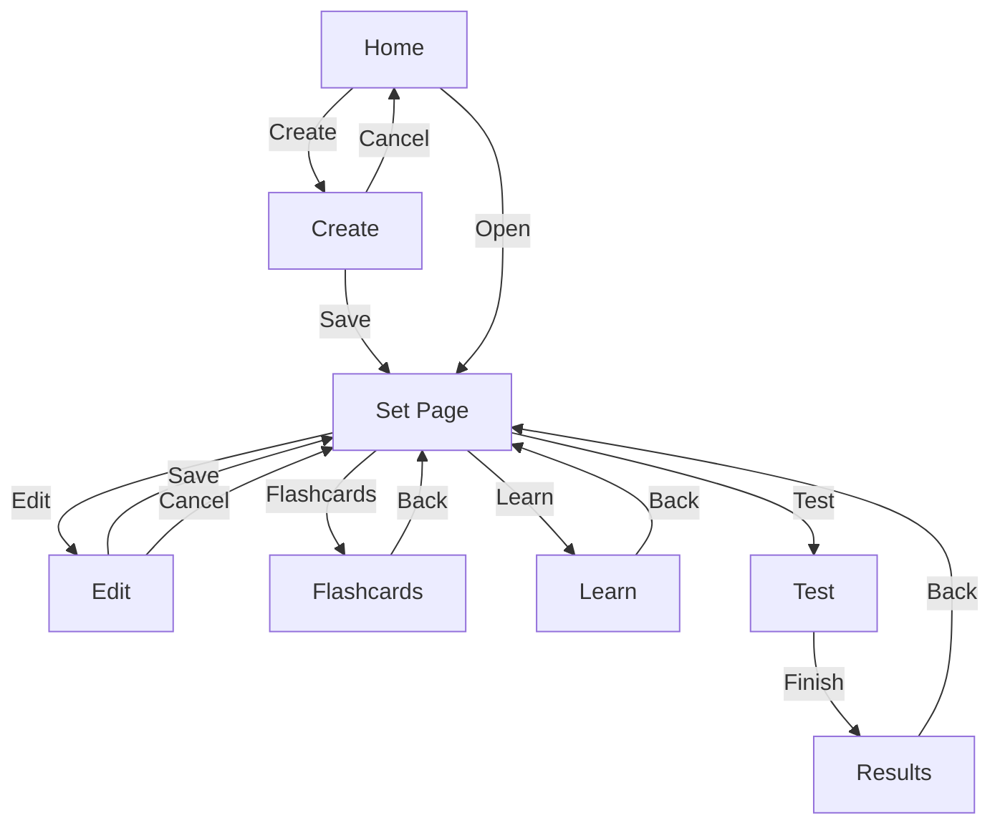
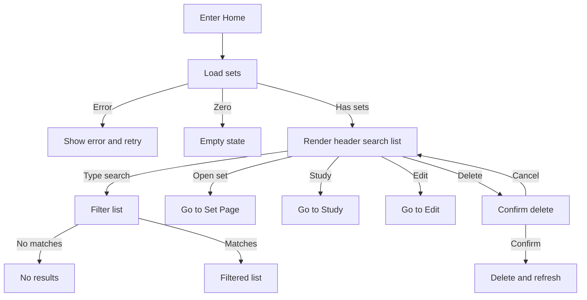
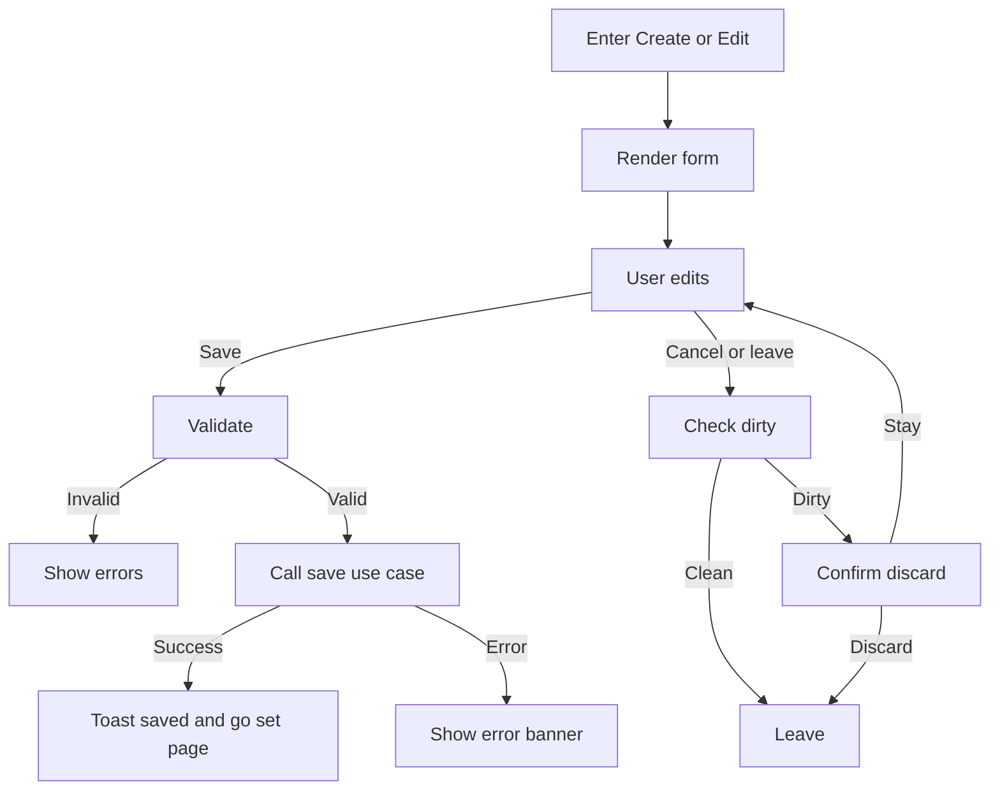
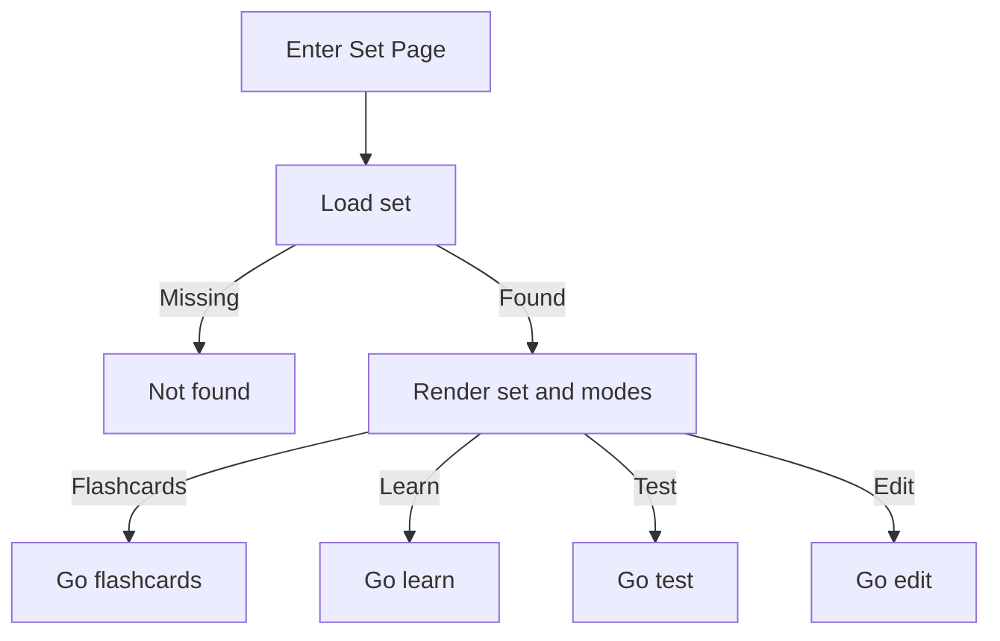
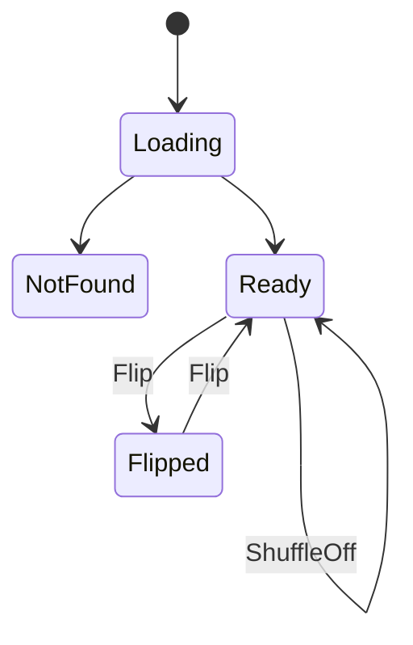
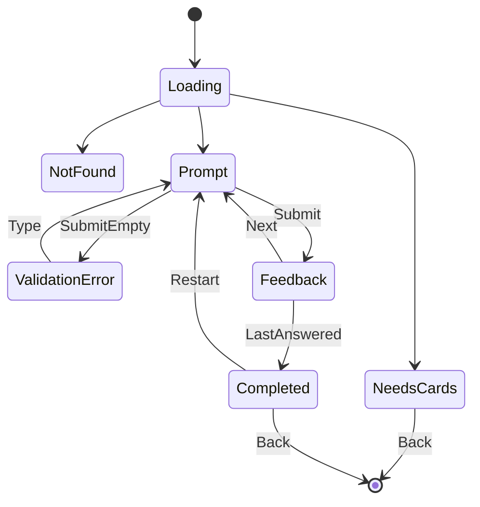
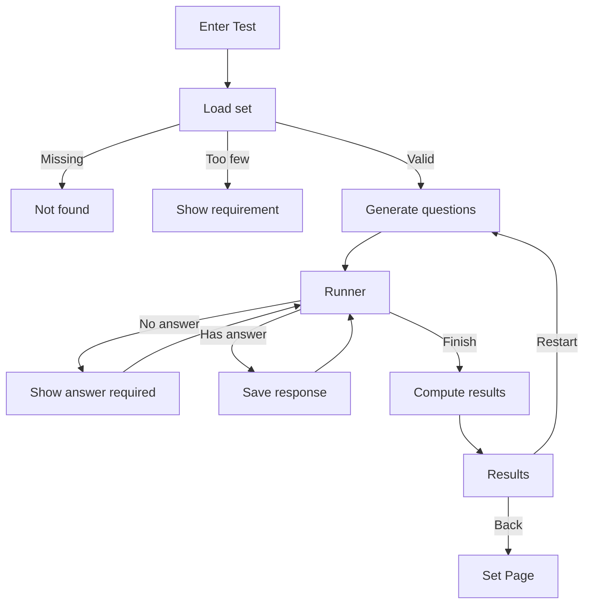

# Technical Requirement — Web UI (Quizlet-like, Strict)
**Role**: Technical BA  
**Audience**: AI agent / frontend implementer + backend dev owning business logic  
**Goal**: Implement **Quizlet-like** UI flows and interactions as close as possible (core features).  
**Diagram rule**: **All flows must use Mermaid** and must be **GitHub-safe** (avoid special chars in edge labels).

---

## 0) Glossary

- **Set / Study Set**: A collection of cards used for studying.
- **Card**: A pair of **Term** and **Definition**.
- **Study Modes**:
  - **Flashcards**: flip term/definition and navigate
  - **Learn**: typed-answer loop + progress
  - **Test**: MCQ + written questions + results
- **UI Logic**: state transitions, rendering rules, interaction handling.
- **Business Rules**: deterministic behavior described with Given/When/Then.

---

## 1) Scope, Assumptions, Non-Goals

### 1.1 Assumptions
- Local persistence only (localStorage or IndexedDB) via repository abstraction.
- No authentication.
- IDs generated client-side.
- Time formatting computed client-side.

### 1.2 In Scope
- UI pages and components
- UI logic and state
- Navigation flows
- UI validation + empty/loading/error states
- Calling application use-cases

### 1.3 Out of Scope
- Auth, sharing, collaboration
- Server APIs / server actions
- Advanced Quizlet modes
- Rich media

---

## 2) Non-Negotiable Rules for AI

### 2.1 Scope Lock
- ✅ Implement **UI and UI logic** only.
- ❌ Do not change domain/application logic (except calling existing use-cases).
- ❌ Do not add new features outside this spec.

### 2.2 Architecture Boundaries
- UI depends only on `application` layer contracts (use-cases).
- UI must not import domain entities directly.
- UI must not access infrastructure repositories directly.
- Business rules live in domain/application; UI follows outcomes.

### 2.3 Layout Contract (Quizlet-like)
- Centered container (max width) and consistent spacing.
- Header with brand and navigation to Sets.
- Button variants consistent:
  - Primary: Study, Save, Submit, Next, Finish
  - Secondary: Edit, Cancel, Back
  - Destructive: Delete with confirmation

### 2.4 Interaction Contract
All flows below must be implemented:
- Same entry points, default states, enable/disable rules, confirmation flows.

### 2.5 Incremental Delivery
After each milestone AI must report:
1) files changed
2) BR IDs implemented
3) what is next

---

## 3) Tech & UI Constraints

- Next.js App Router + TypeScript strict
- Tailwind utilities only (no custom css files)
- Accessibility: focus visible, labels, keyboard navigation
- No server actions, no API routes
- Zod recommended for UI schemas

---

## 4) Information Architecture and Routes

### 4.1 Key Screens
1. Home (Your Sets)
2. Set Page (Set Detail)
3. Create Set
4. Edit Set
5. Flashcards
6. Learn
7. Test
8. Test Results

### 4.2 Routes
- `/` Home
- `/sets/new` Create
- `/sets/:id` Set Page
- `/sets/:id/edit` Edit
- `/study/:id/flashcards` Flashcards
- `/study/:id/learn` Learn
- `/study/:id/test` Test
- `/study/:id/test/results` Results

---

## 5) Global UX Business Rules (Quizlet-like)

### BR-UX-01 Primary action is obvious
- Given user is on Home or Set Page
- When page renders
- Then Study must be visually primary.

### BR-UX-02 No dead UI
- Given a control is not allowed
- When it is shown
- Then it must be disabled and explain why.

### BR-UX-03 Confirm destructive actions
- Given user clicks Delete
- When confirmation appears
- Then explicit confirm is required.

### BR-UX-04 Save feedback
- Given user saves
- When save succeeds
- Then show toast Saved and navigate to Set Page.
- When save fails
- Then show error banner and stay on page.

### BR-UX-05 Loading and not found
- Given a page loads data
- When loading
- Then show loading state.
- When set not found
- Then show not found screen with Back link.

---

## 6) Validation Rules

### 6.1 UI Validation
- Title required, max 120
- Description optional, max 500
- Card term required, max 2000
- Card definition required, max 2000
- Learn answer required to submit
- Test answer required to proceed

UI behavior:
- Inline error near field
- On Save scroll to first invalid
- Errors clear as user types

### 6.2 Domain Validation (Authoritative)
- Domain re-validates on save
- UI must handle domain errors by showing banner and staying on page

---

## 7) Detailed Business Rules (Given When Then)

### 7.1 Sets Create and Edit

#### BR-SET-01 Minimum one card
- Given user is creating or editing a set
- When Save is clicked
- Then if there are zero cards, block save and show error.

#### BR-SET-02 Title required
- Given user is editing a set
- When title is empty and Save is clicked
- Then block save and show inline error.

#### BR-SET-03 Term and definition required
- Given a card row exists
- When term or definition is empty on Save
- Then block save and show row level errors.

#### BR-SET-04 Trim on save
- Given inputs have extra whitespace
- When Save is clicked
- Then persist trimmed strings and display trimmed.

#### BR-SET-05 Unsaved changes confirmation
- Given form is dirty
- When user navigates away or clicks Cancel
- Then show discard confirmation.

#### BR-SET-06 Delete set confirmation
- Given user clicks Delete
- When confirmation modal appears
- Then delete only on confirm, then show toast Deleted.

---

### 7.2 Home Search and List

#### BR-LIST-01 Search filters title and description
- Given user is on Home
- When user types in search
- Then filter by case-insensitive substring on title or description.

#### BR-LIST-02 Clear search resets
- Given search is not empty
- When user clears it
- Then show full list.

#### BR-LIST-03 Count display
- Given list loaded
- Then show N sets with correct pluralization.

#### BR-LIST-04 No results state
- Given filtering returns zero
- Then show no results and allow clearing search.

---

### 7.3 Flashcards

#### BR-FC-01 Term first
- Given flashcards start
- Then show Term side first.

#### BR-FC-02 Flip interaction
- Given a card is visible
- When user flips
- Then toggle Term and Definition.

#### BR-FC-03 Nav edges disabled
- Given index is first
- Then Prev disabled.
- Given index is last
- Then Next disabled.

#### BR-FC-04 Reset flip on navigation
- Given card is flipped
- When Next or Prev is used
- Then new card starts on Term.

#### BR-FC-05 Shuffle is in-memory only
- Given shuffle is enabled
- When toggled on
- Then reorder in memory and reset index to 0.
- When toggled off
- Then restore original order and reset index to 0.

Keyboard:
- Space flips
- Optional arrows navigate

---

### 7.4 Learn

#### BR-LEARN-01 Prompt term answer definition
- Given learn mode is running
- Then prompt shows Term and expects Definition.

#### BR-LEARN-02 Matching rule
- Given correct definition D and user input A
- When user submits
- Then correct if trim lower A equals trim lower D.

#### BR-LEARN-03 Empty answer blocked
- Given answer is empty
- When Submit clicked
- Then show inline error and do not advance.

#### BR-LEARN-04 Feedback content
- Given answer submitted
- Then show correct or incorrect.
- If incorrect, show correct answer and user answer.

#### BR-LEARN-05 Next gated
- Given user has not submitted current question
- Then Next disabled.
- When submitted
- Then Next enabled.

#### BR-LEARN-06 Completion and restart
- Given all cards answered
- Then show summary and allow Restart and Back.

---

### 7.5 Test

#### BR-TEST-00 Minimum cards
- Given set has fewer than 3 cards
- When entering test
- Then show requirement message and block starting test.

#### BR-TEST-01 Question generation
- Given test starts
- Then generate questions from cards.

#### BR-TEST-02 Mixed types
- Given test generated
- Then include MCQ and Written questions.

#### BR-TEST-03 MCQ choices
- Given an MCQ question for a card
- Then include correct choice and at least 2 incorrect choices, shuffled.

#### BR-TEST-04 Answer required
- Given user is on a question
- When clicking Next or Finish without answer
- Then show error and block.

#### BR-TEST-05 Results
- Given test finished
- Then compute correct and incorrect counts and show review.

---

## 8) UI Component Behavior Specs

### 8.1 SearchInput
- Updates query on change
- Filters list live
- Optional debounce

### 8.2 StudySetCard
- Clicking card area opens Set Page
- Study is primary
- Edit is secondary
- Delete is destructive with confirm
- Shows title and meta

### 8.3 SetForm
- Create starts with one empty card row
- Add card appends and focuses term
- Cannot remove last row
- Save validates and scrolls to first invalid

### 8.4 Flashcard
- Centered card with progress indicator
- Flip by click and Space
- Reset flip on Next Prev

### 8.5 LearnQuestion
- Prompt term and input
- Submit gives feedback
- Next requires submit
- Completion view supports restart

### 8.6 TestQuestion
- MCQ uses radio options
- Written uses text input
- Next requires answer
- Results show per question review

---

## 9) Edge Cases

- Set not found shows Not Found and Back.
- No cards disables study modes with explanation.
- Too few cards blocks test.
- Long text wraps and remains readable.
- Duplicate definitions: try to avoid duplicates in MCQ; if not possible, still provide best effort.

---

## 10) Acceptance Criteria

- All BR rules implemented.
- UI follows Mermaid flows.
- No business logic in UI beyond calling use-cases and managing state.
- Confirm discard and confirm delete implemented.
- Accessible keyboard and focus states.
- UI feels guided like Quizlet: primary CTA obvious, progress visible.

---

## 11) Mermaid Flows (GitHub-safe)

### 11.1 Global Navigation Flow


### 11.2 Home Flow



### 11.3 Create Edit Flow



### 11.4 Set Page Flow



### 11.5 Flashcards State Flow



Flashcards rules applied:

* Ready default: index 0, side Term, shuffled false
* Flip is click card or Space
* Next and Prev disabled at edges
* Next and Prev reset side to Term
* Shuffle changes in-memory order only and resets index

### 11.6 Learn State Flow



Learn rules applied:

* Prompt shows term, Next disabled until submit
* SubmitEmpty shows error
* Submit checks correctness and shows feedback
* Completed shows summary and allows restart

### 11.7 Test Flow



---

## 12) LLM Prompt Block (Copy Paste)

```text
You are implementing a Quizlet-like web UI. Follow the Technical Requirement exactly.

Hard rules:
- Implement the flows and Given When Then behaviors exactly.
- Only modify UI layer code.
- Do not change business domain application code except calling use cases.
- No new features beyond this spec.
- Keep code clean, small components, consistent Tailwind styles, accessible UI.

Deliverables:
- Home list search actions with confirm delete and empty states.
- Set page with study modes and card preview.
- Create edit with row editor validation and discard confirm.
- Flashcards flip next prev shuffle and reset flip on nav.
- Learn typed loop submit feedback progress completion restart.
- Test min cards mix questions require answer results review.

After each milestone:
1 files changed
2 BR IDs implemented
3 next step
```

```
::contentReference[oaicite:0]{index=0}
```
