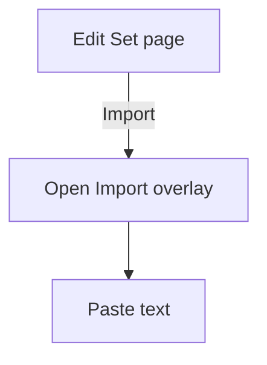
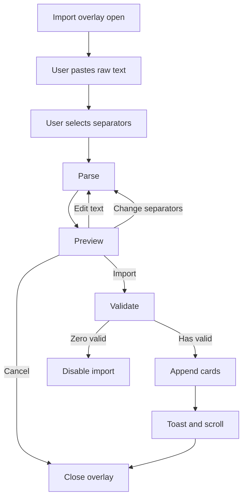
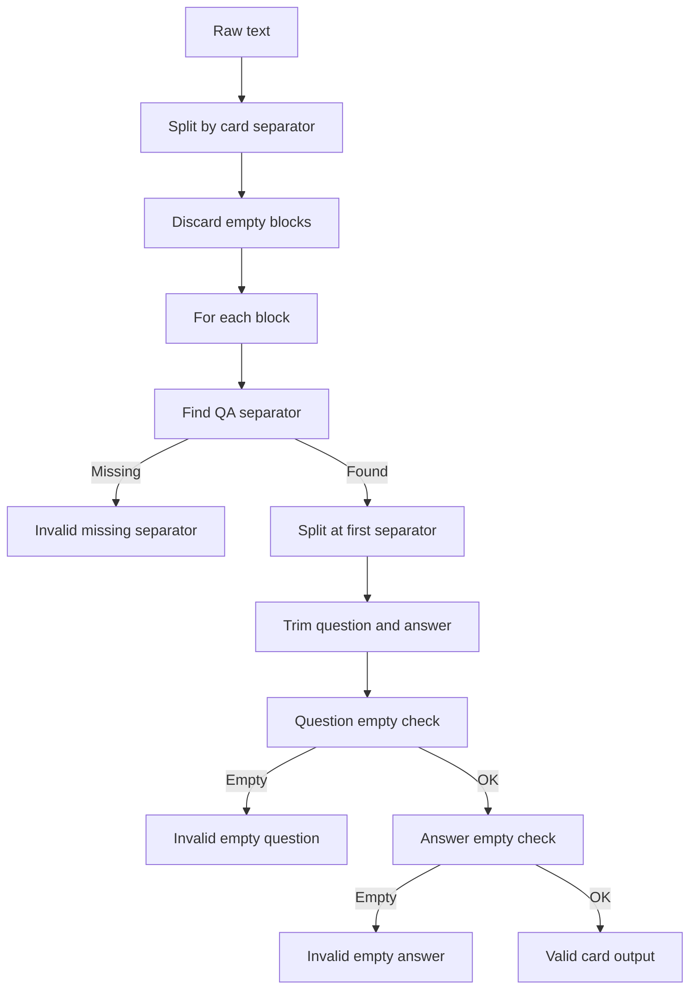

# Quizlet-like Import UX — 1:1 Mapping Spec (Micro-interactions + Business Rules)

**Role**: Senior UI/UX + Technical BA  
**Goal**: Replicate Quizlet import experience as closely as possible for bulk importing cards (Question/Answer).  
**Key references**: Quizlet Help Center import instructions and separators (term/definition: comma/tab/dash; rows: semicolon/new line). :contentReference[oaicite:2]{index=2}

---

## 1) Where user enters Import (Entry points) — like Quizlet

### EP-01: Create/Edit Set page (card list editor)
**Placement**: In the “Terms and definitions” section toolbar, show a link/button:
- `Import` (secondary)
- Optional helper text: `Import from Word, Excel, Google Docs, etc.` (Quizlet wording inspiration) :contentReference[oaicite:3]{index=3}

**Given/When/Then**
- **Given** user is on Create/Edit Set page  
- **When** user clicks `Import`  
- **Then** open Import overlay without leaving the page (modal or drawer)

---

### EP-02: Empty state entry
- If set has 0 cards, show a prominent CTA: `Import cards`.

**Given/When/Then**
- **Given** the set has 0 cards  
- **When** the page renders  
- **Then** display `Import cards` as the primary CTA

---

## 2) Quizlet-like Import Screen Structure (Single overlay with 3 zones)

Quizlet import UI generally contains:
1) Paste box (large)
2) Separator selectors (Between term/definition, Between cards/rows)
3) Preview list

**Required UI zones**
- Zone A: Paste text area
- Zone B: Separator settings (radio + custom input)
- Zone C: Preview

---

## 3) Separator UX (Custom-first + 2 defaults)

Quizlet supports separators:
- Between term and definition: comma, tab, dash :contentReference[oaicite:4]{index=4}
- Between rows/cards: semicolon, new line :contentReference[oaicite:5]{index=5}

Your requirement: **Custom is available and prominent**, plus **2 default options**.

### 3.1 Between Question and Answer (Term/Definition separator)
**Options**
- Default 1: `Tab`
- Default 2: `Comma`
- Custom: `Custom` + input (selected by default)

**BR-SEP-QA-01**
- **Given** import screen opens  
- **When** no previous user preference  
- **Then** select `Custom` by default AND prefill a sensible default (e.g. `;`)

**BR-SEP-QA-02**
- **Given** user selects `Tab`  
- **Then** QA separator value becomes `\t`

**BR-SEP-QA-03**
- **Given** user selects `Comma`  
- **Then** QA separator value becomes `,`

**BR-SEP-QA-04**
- **Given** user selects `Custom`  
- **When** custom input is empty or whitespace  
- **Then** mark separator invalid and disable Import

---

### 3.2 Between Cards (Row separator)
**Options**
- Default 1: `New line`
- Default 2: `Semicolon`
- Custom: `Custom` + input (selected by default)

**BR-SEP-CARD-01**
- **Given** user selects `New line`  
- **Then** card separator is `\n` (treat Windows `\r\n` as `\n`)

**BR-SEP-CARD-02**
- **Given** user selects `Semicolon`  
- **Then** card separator is `;`

**BR-SEP-CARD-03**
- **Given** user selects `Custom` and enters `::`  
- **Then** card separator is `::` and split must use that exact token

---

### 3.3 Swap separators (Quizlet-like micro interaction)
Quizlet import expects “term/definition” vs “rows”. Many users paste inverted order.

**BR-SEP-SWAP-01**
- **Given** preview shows many invalid due to missing QA separator  
- **When** user clicks `Swap separators` (optional but very useful)  
- **Then** swap QA separator and Card separator, re-parse, and re-render preview

> Optional feature, but strongly improves UX and reduces friction.

---

## 4) Parsing Rules (Core business behavior)

> Parsing must match preview exactly.

### 4.1 Normalize input
**BR-PARSE-01**
- **Given** raw text is pasted  
- **When** parsing begins  
- **Then** normalize line endings: convert `\r\n` to `\n`

### 4.2 Split into card blocks by card separator
**BR-PARSE-02**
- **Given** card separator configured  
- **When** parsing  
- **Then** split raw text into blocks by that separator

**BR-PARSE-03**
- **Given** there are empty blocks (whitespace-only)  
- **Then** discard them

**BR-PARSE-04**
- **Given** N blocks remain after discard  
- **Then** preview count equals N (valid + invalid combined)

### 4.3 Split each block into Question and Answer
**BR-PARSE-05**
- **Given** a card block  
- **When** QA separator is found  
- **Then** split at the **first occurrence only**
- **And** left side = Question (term), right side = Answer (definition)

**BR-PARSE-06**
- **Given** QA separator is missing in a block  
- **Then** mark block Invalid with error `Missing separator`

### 4.4 Trim policy (Quizlet-like)
Quizlet expects clean inputs; trims are safe.

**BR-PARSE-07**
- **Given** Question or Answer parsed  
- **Then** trim leading/trailing whitespace
- **And** preserve internal whitespace and newlines in Question (so “A. B. C.” formatting stays)

---

## 5) Preview UX (Micro-interactions like Quizlet)

### 5.1 Preview is live
**BR-PREV-01**
- **Given** user changes any setting (text or separators)  
- **Then** preview updates immediately (or within debounce 150–250ms)

### 5.2 Preview shows both sides
Preview row should show:
- Left: Question (term)
- Right: Answer (definition)
- Index number
- Status: Valid/Invalid with reason (if invalid)

**BR-PREV-02**
- **Given** a card is invalid  
- **Then** show a clear reason:
  - Missing separator
  - Empty question
  - Empty answer

### 5.3 Import button state
**BR-PREV-03**
- **Given** there are 0 valid cards  
- **Then** disable `Import` button

**BR-PREV-04**
- **Given** there are valid cards  
- **Then** enable Import and show label: `Import N cards`

### 5.4 Skip invalid (Quizlet-like safety)
Quizlet often allows you to proceed if data looks OK; we include a “skip invalid” toggle.

**BR-PREV-05**
- **Given** there exist invalid cards  
- **When** `Skip invalid` is ON (default)  
- **Then** import will include only valid cards and ignore invalid

**BR-PREV-06**
- **Given** `Skip invalid` is OFF  
- **When** any invalid exists  
- **Then** disable Import and show message `Fix invalid rows or enable skip invalid`

---

## 6) Import Execution & Post-import micro-interactions

### 6.1 Append behavior
**BR-IMP-01**
- **Given** the set already has cards  
- **When** import executes  
- **Then** append imported cards at the end (do not overwrite existing)

### 6.2 Close + toast + scroll
**BR-IMP-02**
- **Given** import succeeds  
- **Then** close import overlay, show toast `Imported N cards`, and scroll to first new card

### 6.3 Large import guard
**BR-IMP-03**
- **Given** valid cards > 200  
- **When** user clicks Import  
- **Then** show confirm dialog: `Import 200+ cards?` and require confirm

---

## 7) Mermaid Flows (GitHub-safe)

### 7.1 Entry to Import

### 7.2 Import screen interaction loop

### 7.3 Parsing flow for each card
