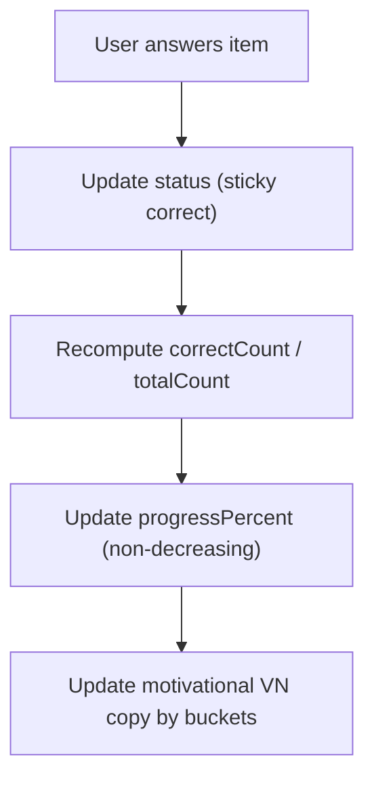

# Learn Mode — Adaptive Retry & Total Progress Append (Quizlet-like, VN-first)
**Type**: APPEND document (extends existing Learn Mode MCQ requirement)  
**Document language**: English  
**UI copy**: Vietnamese only (exact strings included)  
**Applies to**: `/study/:setId/learn` Learn Mode MCQ implementation  
**Key decisions (finalized)**:
1) Retry scope = **incorrect + skipped** (no user choice)  
2) Motivational text = **Vietnamese only**  
3) Retry order = **shuffle in retry sessions**  
4) Adaptive status resets **ONLY when user explicitly requests reset**

---

## 0) Purpose
Current Learn Mode v1 is linear and restarts the entire session on “Học lại”, which is demotivating and unlike Quizlet Learn. This append introduces:
- **Adaptive retry** focusing only on unmastered items (incorrect + skipped)
- **Total progress bar** showing “overall set mastery” during the session
- **VN-first motivational microcopy** to reduce boredom and increase retention

This append MUST NOT break base Learn Mode MCQ rules unless explicitly overridden.

---

## 1) New Data Concepts

### 1.1 Per-item status (session-scoped)
Each LearnItem has a `status`:

```ts
type LearnStatus = "unseen" | "correct" | "incorrect" | "skipped";
```

### 1.2 Learning pool
A session runs over a `pool` (array of itemIds). Pools can be:
- **Main pool**: all items
- **Retry pool**: only incorrect + skipped

### 1.3 Attempt number
Each session has an integer `attempt`:
- `attempt=1` for main pool
- `attempt>=2` for retry pools

Attempt affects:
- whether pool is shuffled
- UI copy variants (“Học lại” vs “Tiếp tục học”)

---

## 2) UX Additions

### 2.1 Total Set Progress Bar (Quizlet-like)
A banner at top of Learn page (above question card), always visible during Learn (except loading/notfound/empty):

**UI elements**
- Motivational line (VN): dynamic (see 2.2)
- Label: `"Tiến độ học"`
- A progress bar showing total mastery %
- Optional count line:
  - `"Đúng: {correctCount} / {totalCount}"`

**Definition**
- `totalCount` = number of items in the full set (N)
- `correctCount` = number of items with status `correct` (across all attempts)
- `progressPercent = floor((correctCount / totalCount) * 100)`

**Hard rule**
- Progress percent MUST NOT decrease during an active Learn journey unless user explicitly resets.

### 2.2 Motivational Vietnamese text
Motivational line is Vietnamese only, short, not “cringe”.
Pick 1 based on `progressPercent`:

- 0–24%: `"Cứ từ từ, bạn đang làm tốt rồi."`
- 25–49%: `"Bạn đang tiến bộ rõ rệt."`
- 50–74%: `"Sắp tới đích rồi, cố lên!"`
- 75–99%: `"Chỉ còn vài câu nữa thôi!"`
- 100%: `"Tuyệt vời! Bạn đã nắm vững bộ thẻ này."`

---

## 3) Adaptive Retry — Business Rules

### 3.1 Status assignment
**BR-ADP-001**  
Given user answers an item correctly  
When feedback is shown  
Then set `status = "correct"`

**BR-ADP-002**  
Given user answers incorrectly  
Then set `status = "incorrect"`

**BR-ADP-003**  
Given user clicks `"Bỏ qua"` in Unanswered state  
Then set `status = "skipped"`

**BR-ADP-004 (sticky correct)**  
Given an item becomes `correct` at any time  
Then it remains `correct` for the rest of the Learn journey (until explicit reset).  
Meaning:
- incorrect -> correct is allowed  
- correct -> incorrect/skipped is NOT allowed within same journey

> Rationale: prevent mastery regression and keep progress increasing, matching learner expectation.

### 3.2 Completion evaluation
**BR-ADP-010**  
Given the current pool is finished  
Then compute:
- `incorrectOrSkipped = items where status in ("incorrect","skipped")`
- `correctCount` (for progress bar)
- show completion screen variant based on whether `incorrectOrSkipped.length > 0`

### 3.3 Retry pool creation (core)
**BR-ADP-020 (critical)**  
Given completion occurs and `incorrectOrSkipped.length > 0`  
Then offer **retry** that includes **only** those incorrect+skipped items.  
Correct items MUST NOT reappear in retry.

**BR-ADP-021 (no choice)**  
Retry scope must be automatic incorrect+skipped. Do NOT ask user to choose.

**BR-ADP-022 (shuffle retry)**  
Given retry pool is created (attempt >= 2)  
Then shuffle item order (stable within that retry attempt).

### 3.4 Completion UI variants
#### Variant A: completion with mistakes remaining
Show:
- Title: `"Chưa xong đâu"`
- Body: `"Hãy học lại những câu bạn chưa nắm vững."`
- CTA primary: `"Học lại các câu sai ({k})"` where `k = incorrectOrSkipped.length`
- CTA secondary: `"Về bộ thẻ"`

#### Variant B: final completion (all correct)
Show:
- Title: `"Hoàn thành"`
- Body: `"Tuyệt vời! Bạn đã nắm vững bộ thẻ này."`
- CTA primary: `"Học lại từ đầu"`
- CTA secondary: `"Về bộ thẻ"`

### 3.5 “Học lại” semantics (IMPORTANT)
We introduce two different restart concepts:

**BR-ADP-030 (retry mistakes)**  
“Học lại các câu sai (k)” starts a **retry session** over incorrect+skipped only (attempt++).

**BR-ADP-031 (reset from scratch)**  
“Học lại từ đầu” is an explicit reset:
- clears all statuses back to `unseen`
- clears saved Learn journey persistence for that setId
- starts attempt=1 with full pool

### 3.6 Mid-session exit & resume
Base doc persistence still applies; this append adds:
- Persist item statuses and attempt number
- Resume continues in current pool with same order (including shuffled retry order)

**BR-ADP-040**  
If resume data is corrupt or incompatible:
- fall back to safe reset (attempt=1, full pool)
- show toast (optional): `"Đã đặt lại phiên học để tránh lỗi."`

---

## 4) UI Copy (Append-only, exact strings)
Add these Vietnamese strings (in addition to base doc):

- Completion (mistakes):
  - Title: `"Chưa xong đâu"`
  - Body: `"Hãy học lại những câu bạn chưa nắm vững."`
  - Retry CTA template: `"Học lại các câu sai ({k})"`

- Reset completion:
  - Restart from scratch: `"Học lại từ đầu"`

- Progress label:
  - `"Tiến độ học"`
  - `"Đúng: {correctCount} / {totalCount}"` (optional but recommended)

- Optional reset safety toast:
  - `"Đã đặt lại phiên học để tránh lỗi."`

---

## 5) Mermaid Flows (Append)

### 5.1 Completion branching
```mermaid
flowchart TD
  A["Finish current pool"] --> B["Compute incorrectOrSkipped"]
  B -->|k>0| C["Completion Variant A: 'Chưa xong đâu'"]
  B -->|k=0| D["Completion Variant B: 'Hoàn thành' (final)"]

  C -->|Click 'Học lại các câu sai (k)'| E["Create retry pool = incorrect+skipped"]
  E --> F["attempt++ ; shuffle pool ; start retry"]

  D -->|Click 'Học lại từ đầu'| G["Explicit reset statuses + persistence"]
  G --> H["attempt=1 ; full pool ; start main"]
```

### 5.2 Progress bar updates


---

## 6) Validation & Abuse Coverage
- “Sticky correct” prevents progress regression if user makes later mistakes.
- Retry pool includes skipped (VN exam mindset: skipped ≈ wrong).
- Retry shuffle reduces memorization by order.
- Reset requires explicit user action “Học lại từ đầu”.

---

## 7) Test Plan (Append-specific)

### 7.1 Must-pass UX scenarios (browser-control)
**A1: Your reported case**  
- Create set with 4 items  
- Answer: 2 correct, 2 incorrect  
Expected:
- Completion shows Variant A
- Button: “Học lại các câu sai (2)”
- Clicking it starts retry with exactly 2 items
- Progress bar shows 50% before retry begins

**A2: Retry resolves**  
- In retry, answer both correctly  
Expected:
- Final completion Variant B
- Progress reaches 100%
- No correct item appears again unless user chooses “Học lại từ đầu”

**A3: Retry shuffle**  
- Have 5 incorrect+skipped items  
- Start retry twice (attempt 2 then attempt 3)  
Expected:
- Within each attempt order is stable (refresh keeps order)
- Across attempts, order can differ (shuffle again)

**A4: Sticky correct**  
- Answer item incorrect in attempt 1  
- Answer correct in attempt 2  
Expected:
- Status becomes correct and remains correct
- Progress never decreases

**A5: Explicit reset**  
- Finish all correct (100%)  
- Click “Học lại từ đầu”  
Expected:
- Status cleared to unseen
- Progress resets to 0%
- attempt back to 1

### 7.2 Regression checks (must not break base v1)
- Keyboard shortcuts still work
- Skip still works
- Persistence/resume still works
- Copy still Vietnamese and exact

---

## 8) Required Engineering Deliverables (Append)
- Extend session state to include:
  - `statusByItemId`
  - `attempt`
  - `poolItemIds` (current pool order)
- Add completion variants + buttons
- Add progress banner component + computations
- Add testids:
  - `learn-progress-banner`
  - `learn-progress-label`
  - `learn-progress-percent`
  - `learn-retry-wrong`
  - `learn-restart-from-scratch`

---

## 9) Non-Goals Reminder
This append still does NOT add:
- Multi-answer
- Spaced repetition schedule
- Cross-session mastery beyond the current Learn journey (unless you decide later)
