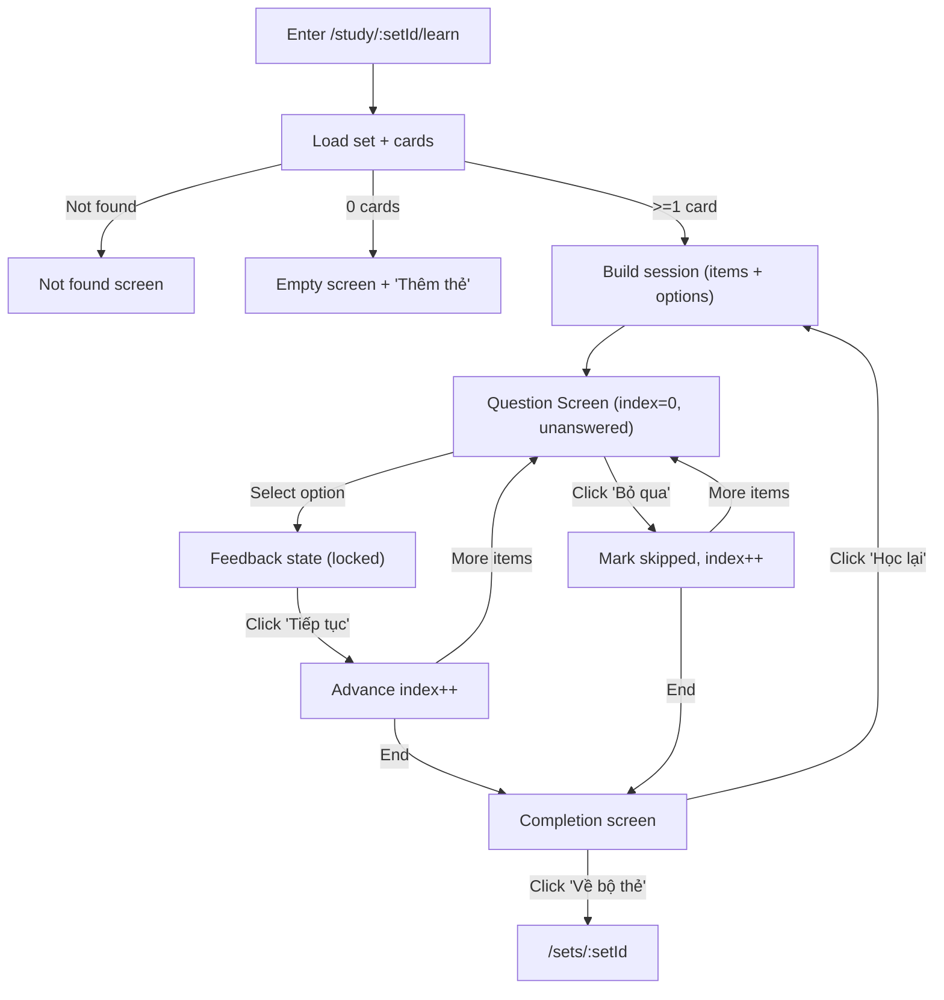
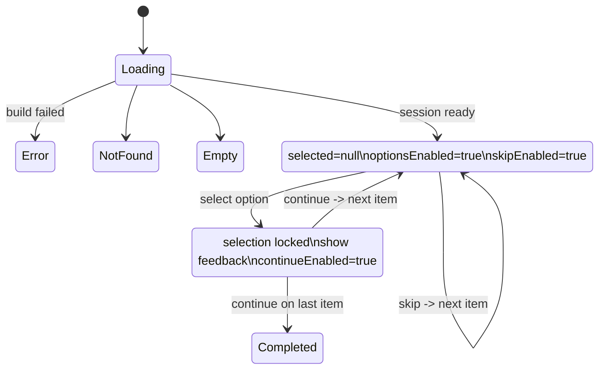

# Learn Mode MCQ (VN-first, Quizlet-like) — Full Technical Requirement
**Document language**: English  
**All user-facing UI copy**: Vietnamese only (exact strings included below)  
**Audience**: Vietnamese high-school & university students (non-technical)  
**Primary goal**: Implement Learn Mode as **Multiple Choice Questions (MCQ)** auto-generated from existing flashcards (Term/Definition) with **excellent UX**, zero ambiguity for implementers.

---

## 0) Scope and Non-scope

### In scope
- Learn Mode route and UX: `/study/:setId/learn`
- Auto-generated MCQ questions from set cards
- 4 options (default) with 1 correct answer; gracefully handle N < 4
- Deterministic, spec-defined generation rules (no “AI guessing”)
- VN-first copy, keyboard + mobile usability
- Persistence/resume (local) and completion summary
- Comprehensive UX validation and abuse/failure handling

### Out of scope (do not implement now)
- Auth/login/signup/onboarding
- Server sync / cloud accounts
- Multi-correct (multi-select) questions
- Spaced repetition algorithm beyond rules below
- “Teacher/Classroom” features
- AI-generated distractors outside current set

---

## 1) Product Intent (PO-level)
Students in VN want fast practice, low friction, immediate feedback. They paste/import card content and can start Learn immediately. Learn should feel encouraging and deterministic.

---

## 2) Definitions and Data Model

### 2.1 Card
A flashcard with:
- `id: string` (required; if your current model doesn’t have it, derive stable id)
- `term: string`
- `definition: string`
Optional existing fields are allowed but ignored by Learn Mode v1.

### 2.2 Learn Session
A session is a run of Learn Mode for a set:
- Generated at start based on current cards
- Consists of ordered `LearnItem[]`
- Persists progress and answered outcomes locally
- Resumable on refresh

### 2.3 Learn Item
Each LearnItem is derived from a single Card:
- `itemId: string` (stable within session)
- `cardId: string`
- `type: "TERM_TO_DEF"` (required v1)
- `prompt: string` (term for v1)
- `correctAnswer: string` (definition for v1)
- `options: Option[]` (built once at session creation; must not change mid-session)
- `createdAtIndex: number` (index in session order, for debug/trace)

### 2.4 Option
- `optionId: string` (stable)
- `label: string` (displayed text; may be truncated in UI)
- `value: string` (full text)
- `isCorrect: boolean`

---

## 3) Routes, Entry Points, Navigation

### 3.1 Canonical route
- `/study/:setId/learn`

### 3.2 Entry points
From Set page `/sets/:setId`:
- Button label: `"Học"`
- Clicking navigates to `/study/:setId/learn`

From Flashcards page (optional if UI already has mode tabs):
- Mode label: `"Học"`
- Navigates to `/study/:setId/learn`

### 3.3 Back behavior
- Back control always returns to `/sets/:setId`
- Browser Back must not break session integrity (if user comes back to Learn, resume if possible)

---

## 4) UI Copy (Vietnamese only, exact)
These strings MUST be used exactly (case, punctuation):

### 4.1 Common
- Loading: `"Đang tải..."`
- Back: `"Quay lại"`
- Retry: `"Thử lại"`

### 4.2 Empty / Not found
- Empty title: `"Chưa có thẻ nào"`
- Empty body: `"Hãy thêm thẻ để bắt đầu học."`
- Empty CTA: `"Thêm thẻ"`

- Not found title: `"Không tìm thấy bộ thẻ"`
- Not found CTA: `"Quay lại"`

### 4.3 Learn Screen
- Hint label: `"Chọn đáp án đúng"`
- Skip button: `"Bỏ qua"`
- Continue button: `"Tiếp tục"`

Correct:
- Correct title: `"Đúng rồi!"`

Incorrect:
- Incorrect title: `"Chưa đúng"`
- Incorrect body prefix: `"Đáp án đúng là: "`

Completion:
- Completion title: `"Hoàn thành"`
- Summary labels:
  - `"Đúng"`
  - `"Sai"`
  - `"Bỏ qua"`
- Restart: `"Học lại"`
- Back to set: `"Về bộ thẻ"`

System error:
- Build session error: `"Có lỗi khi tạo bài học. Vui lòng thử lại."`

---

## 5) Screen Inventory and UI Structure

### 5.1 Loading Screen
**Visible**
- Skeleton question card
- Disabled option buttons (placeholder)
- Text: `"Đang tải..."`

**Rules**
- If load > 1s, keep skeleton; no spinners required.

### 5.2 Not Found Screen
**Visible**
- Title: `"Không tìm thấy bộ thẻ"`
- CTA: `"Quay lại"` → `/`

**Constraints**
- Must never show `/sets/undefined` anywhere.

### 5.3 Empty Set Screen
**Visible**
- Title: `"Chưa có thẻ nào"`
- Body: `"Hãy thêm thẻ để bắt đầu học."`
- CTA: `"Thêm thẻ"` → `/sets/:setId/edit`

### 5.4 Learn Question Screen (MCQ)
**Layout**
- Top bar:
  - Back icon/button (left)
  - Set title (center)
  - Progress (right): `"{current}/{total}"` (e.g., `1/10`)
- Prompt card:
  - Prompt text (term)
  - Hint: `"Chọn đáp án đúng"`
- Options:
  - 4 option buttons (or fewer if N<4)
  - Each option is tappable; large touch target mobile
- Bottom actions:
  - Skip `"Bỏ qua"` (left) (enabled before answering)
  - No Continue button until after selection

**After selection (Feedback state)**
- Show status area:
  - If correct: `"Đúng rồi!"`
  - If incorrect: `"Chưa đúng"` + `"Đáp án đúng là: <correct>"`
- Show `"Tiếp tục"` button (primary)
- Options become locked (no changing choice)

### 5.5 Completion Screen
**Visible**
- Title: `"Hoàn thành"`
- Summary chips/rows:
  - `"Đúng: X"`
  - `"Sai: Y"`
  - `"Bỏ qua: Z"`
- Actions:
  - `"Học lại"` (primary)
  - `"Về bộ thẻ"` (secondary)

---

## 6) Interaction Flows (Mermaid)

### 6.1 Global Learn Mode flow

### 6.2 Question state machine

---

## 7) Business Rules (Given/When/Then)

### 7.1 Session build
**BR-SES-001**
Given user enters `/study/:setId/learn`  
When set is loaded and has >= 1 card  
Then build a Learn Session with exactly **N items** (one per card), type `"TERM_TO_DEF"`.

**BR-SES-002**
Given session is built  
Then item order must follow the **current card order** in the set (no shuffle in v1).

**BR-SES-003**
Given session is built  
Then options for each item must be created **once** and remain stable for the session (including after refresh resume).

**BR-SES-004**
Given session build fails (unexpected error)  
Then show error UI:
- `"Có lỗi khi tạo bài học. Vui lòng thử lại."`
- Button: `"Thử lại"` which retries build.

### 7.2 Option generation (MCQ)
**BR-MCQ-001 (Option count)**
Given set has N cards  
When generating options for an item  
Then `optionCount = min(4, N)`.

**BR-MCQ-002 (Correct option)**
Given item derived from card C  
Then option list must include exactly 1 correct option = C.definition.

**BR-MCQ-003 (Distractors source)**
Given optionCount > 1  
Then distractors must be selected from **definitions of other cards** in the same set (exclude C).

**BR-MCQ-004 (Uniqueness)**
Given building option list  
Then visible labels must be unique by normalized compare:
- trim
- collapse whitespace
- lowercase
- replace newlines with spaces

If duplicates occur:
- keep selecting next candidate distractors until unique OR candidates exhausted.

**BR-MCQ-005 (Insufficient unique distractors)**
Given N < 4 or duplicates reduce unique pool  
Then show fewer options (>=1). Do not block Learn.

**BR-MCQ-006 (Stable options)**
Given session built  
Then each item’s option set (members) is stable.  
Only the display order may be randomized once at build time per item.

**BR-MCQ-007 (Display truncation)**
Given a definition is long or multi-line  
Then UI may truncate label visually (first line + ellipsis), but must keep full value for “Đáp án đúng là: …”.

### 7.3 Answering & feedback
**BR-ANS-001 (Selection required)**
Given Unanswered state  
Then `"Tiếp tục"` is not shown/enabled.

**BR-ANS-002 (Selecting an option)**
When user selects an option  
Then:
- lock selection
- disable other options
- compute correctness
- enter Feedback state

**BR-ANS-003 (Correct feedback)**
Given selection is correct  
Then show `"Đúng rồi!"` and show `"Tiếp tục"`.

**BR-ANS-004 (Incorrect feedback)**
Given selection is incorrect  
Then show:
- `"Chưa đúng"`
- `"Đáp án đúng là: <correctAnswer>"`

**BR-ANS-005 (Continue)**
When user clicks `"Tiếp tục"`  
Then advance to next item (index+1) and reset to Unanswered.

**BR-ANS-006 (Skip)**
Given Unanswered state  
When user clicks `"Bỏ qua"`  
Then mark item outcome = skipped and advance immediately to next item with Unanswered state.

**BR-ANS-007 (Skip disabled after answering)**
Given Feedback state  
Then `"Bỏ qua"` must be hidden/disabled.

### 7.4 Keyboard & focus
**BR-KBD-001**
Given Unanswered state with K options  
Then keys `1..K` select corresponding option (1-based).

**BR-KBD-002**
Given Feedback state  
Then `Enter` triggers `"Tiếp tục"`.

**BR-KBD-003**
Focus rules:
- When question loads: focus first option button
- When Feedback appears: focus `"Tiếp tục"` button
- Escape behavior: `Esc` triggers Back confirm only if needed; otherwise navigate back to set.

### 7.5 Completion
**BR-CMP-001**
Given last item is continued or skipped  
Then show Completion screen with counts:
- correct
- incorrect
- skipped

**BR-CMP-002**
When user clicks `"Học lại"`  
Then rebuild a new session from current cards (fresh outcomes).

**BR-CMP-003**
When user clicks `"Về bộ thẻ"`  
Then navigate to `/sets/:setId`.

### 7.6 Persistence / Resume
**BR-PRS-001 (Persist progress)**
Given any answered/skipped action  
Then persist session state locally keyed by setId:
- currentIndex
- outcomes per itemId
- option sets per itemId (so refresh does not change prior options)
- timestamp

**BR-PRS-002 (Resume)**
Given user refreshes page mid-session  
Then restore:
- same session items and options
- last currentIndex
- answered outcomes up to that point

If restore fails (corrupt data):
- reset session safely (start new) and do not crash.

**BR-PRS-003 (Versioning)**
Persisted state must include a version string so future schema changes can invalidate safely.

---

## 8) Validation Rules and Abuse Handling

### 8.1 Content validity
- Empty term/definition is allowed; use placeholders:
  - term placeholder: `"(Không có thuật ngữ)"`
  - definition placeholder: `"(Không có nội dung)"`
- Option uniqueness uses normalized compare; do not crash.

### 8.2 Interaction safety
- Double-click protection:
  - In Feedback state, ignore repeated clicks on `"Tiếp tục"` within 300ms
- Option click race:
  - After first selection, all options disabled

### 8.3 Error handling
- Build error shows `"Có lỗi khi tạo bài học. Vui lòng thử lại."` with `"Thử lại"` button.
- Not found / empty states must be deterministic.

---

## 9) Accessibility and Mobile UX
- Touch targets >= 44px height
- Focus ring visible
- Screen reader labels for options: “Lựa chọn 1”, “Lựa chọn 2”… (if accessible labels exist)
- Mobile: options stacked; no overflow; continue button always visible in feedback.

---

## 10) Testing Plan (Mandatory)

### 10.1 Browser-control E2E UX test checklist (must pass)
T1. Normal set (>=4): open `/study/:id/learn`, see progress + 4 options  
T2. Choose correct: shows `"Đúng rồi!"` then `"Tiếp tục"` advances  
T3. Choose incorrect: shows `"Chưa đúng"` + correct answer  
T4. Keyboard: 1..4 selects; Enter continues  
T5. Low N=1/2/3: optionCount=min(4,N), still usable  
T6. Duplicates: no duplicate visible options  
T7. Skip: `"Bỏ qua"` works and counted  
T8. Refresh mid-session: resume works, options stable  
T9. Completion: summary counts correct; actions work  
T10. Restart: `"Học lại"` starts fresh  
T11. Mobile: no overflow, buttons usable

### 10.2 Unit tests (recommended)
- `buildOptions` uniqueness and low-N behavior
- `normalize` behavior
- persistence schema version fallback

---

## 11) Implementation Constraints (Prevent “Assume”)
- Implementers must not invent new copy text. Use provided copy only.
- Must not change routes to non-canonical paths.
- Must not rely on external APIs; v1 local persistence is acceptable.
- Must not change Flashcards feature behavior.

---

## 12) Required Engineering Deliverables
- Learn route `/study/:setId/learn`
- `learnSessionBuilder` utilities (pure, testable)
- Learn UI components with stable `data-testid` selectors (below)
- Local persistence with versioning
- Minimal doc or comments pointing to BR ids

### 12.1 Required `data-testid` list (must add)
- `learn-root`
- `learn-loading`
- `learn-empty`
- `learn-notfound`
- `learn-progress`
- `learn-prompt`
- `learn-option-1`, `learn-option-2`, `learn-option-3`, `learn-option-4`
- `learn-skip`
- `learn-feedback`
- `learn-continue`
- `learn-complete`
- `learn-restart`
- `learn-back-to-set`

---

# Appendix A — Example MCQ Generation (Deterministic)
Given cards:
1) Term=Cat, Def=Mèo
2) Term=Dog, Def=Chó
3) Term=Bird, Def=Chim
4) Term=Fish, Def=Cá

For item Cat:
- correct = Mèo
- distractors = pick 3 other defs (Chó, Chim, Cá)
- options displayed in shuffled order, stable within session

---

# Appendix B — What to do if Learn mode currently exists as Text Input
- Replace the Learn route UI with MCQ Learn as defined here.
- If the existing “Written Answer” learn mode is not used, keep code but do not expose it.
- Do not break navigation from Set page.
