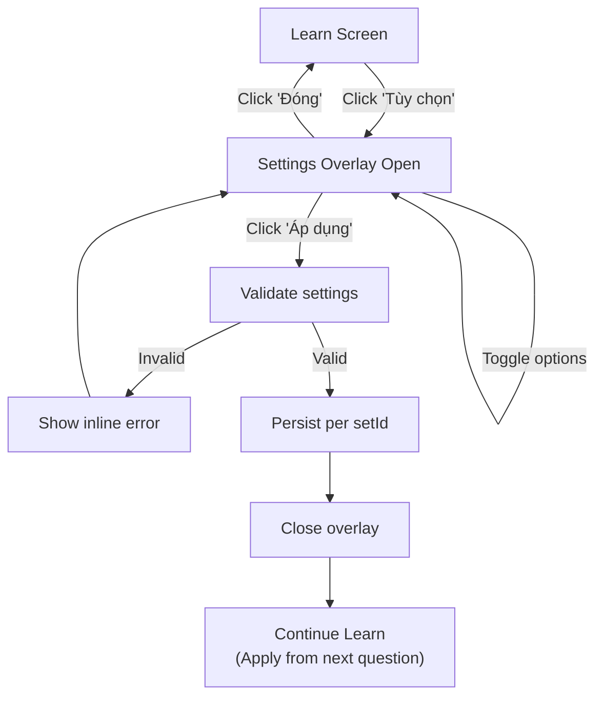
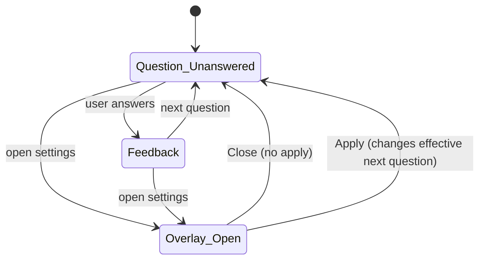

# Learn Mode v2 — Settings Overlay & Question Type Toggles (Quizlet-parity)

**Version**: v2  
**Type**: Append Requirement (extends Learn Mode v1 + existing adaptive progress append if present)  
**Doc language**: English  
**UI copy/labels**: Vietnamese-only  
**Goal**: Add a Quizlet-like “Tùy chọn” overlay in Learn Mode and allow configuring question types + related options, without breaking existing Learn Mode flows.

---

## 1) Scope

### 1.1 In Scope
- Learn Mode settings entry point on Learn screen (icon/button).
- Settings overlay (modal / sheet) with:
  - Question type toggles:
    - Trắc nghiệm (MCQ)
    - Chọn tất cả đáp án đúng (Multi-select)
    - Tự luận (Written)
  - Optional toggles (if feasible, else present disabled):
    - Trộn câu hỏi (Shuffle questions)
    - Hiệu ứng âm thanh (Sound effects)
  - Apply / Close behavior (defined in this doc)
- Persistence:
  - Save settings per `setId` locally (localStorage or existing storage)
  - Restore settings when re-entering Learn for that set
- Safe validation:
  - Prevent “no question types enabled”
  - Handle unsupported types gracefully (disabled + helper text)
- UX correctness:
  - Overlay works on desktop + mobile
  - Does not crash mid-session
  - Does not reset learning status unexpectedly unless explicitly defined

### 1.2 Out of Scope (for v2)
- Implementing the full Multi-select logic if it does not already exist.
- Implementing the full Written Learn logic if it does not already exist.
- Reverse direction (Definition → Term) behavior (reserved for v4 unless confirmed).
- Starred-only learning.

> Note: v2 may expose toggles for not-yet-implemented types, but must clearly mark them as **disabled** with VN helper text.

---

## 2) Dependencies

This v2 appends:
- Learn Mode v1 (MCQ core loop)
- Existing Learn adaptive progress behavior (if already implemented in your clone)

It MUST NOT change:
- Flashcards mode
- Bulk import behavior
- Set CRUD

---

## 3) Definitions & Terminology

- **Question Type**: the interaction format used to test a card.
  - MCQ: pick 1 correct out of 4 options
  - Multi-select: pick multiple correct options (if supported later)
  - Written: type answer (if supported later)
- **Settings Overlay**: a modal/sheet UI where user configures Learn behavior.
- **Availability**: whether a question type can actually run in the current build.
- **Enabled**: whether user wants a question type included in Learn generation.

---

## 4) UX Requirements

### 4.1 Learn Screen Entry Point
- A settings entry point MUST be visible on Learn screen:
  - VN label: `"Tùy chọn"`
  - Or gear icon with accessible label `"Tùy chọn"`
- Placement:
  - Desktop: top-right of Learn header area
  - Mobile: in header or within an overflow menu but still reachable in 1 tap

### 4.2 Settings Overlay Layout
Overlay contains:

**Section A — Loại câu hỏi**
- Toggle row: `"Trắc nghiệm"` (MCQ)
- Toggle row: `"Chọn tất cả đáp án đúng"` (Multi-select)
- Toggle row: `"Tự luận"` (Written)

For each row:
- Label (VN)
- Toggle switch (on/off)
- Helper text (small) when disabled:
  - `"Sắp có"` OR `"Chưa hỗ trợ trong phiên bản này"`

**Section B — Tùy chọn khác**
- Toggle: `"Trộn câu hỏi"`
- Toggle: `"Hiệu ứng âm thanh"`

**Footer actions**
- Primary button: `"Áp dụng"`
- Secondary: `"Đóng"`

### 4.3 Overlay Interaction
- Open overlay:
  - Freeze Learn interactions behind overlay
  - Focus should move into overlay (basic accessibility)
- Close overlay:
  - Via `"Đóng"` button
  - Via ESC (desktop)
  - Optional: click outside closes (if implemented, must match business rules below)

### 4.4 Apply Model (Chosen for v2)
**v2 uses an explicit Apply button**:
- User can toggle settings freely
- Changes only affect Learn after clicking `"Áp dụng"`

Rationale:
- Avoid unexpected mid-session changes
- Matches common settings-sheet behavior

---

## 5) Availability & Disabled States

### 5.1 Availability Rules
- MCQ is ALWAYS available (baseline Learn v1 exists).
- Multi-select availability depends on implementation:
  - If not implemented: show toggle **disabled**
- Written availability depends on implementation:
  - If not implemented: show toggle **disabled**

### 5.2 Disabled Toggle UX
When a toggle is disabled:
- Toggle control is not interactable
- Row shows helper text: `"Sắp có"`
- Row should still be visible to signal future capability

---

## 6) Persistence & Storage

### 6.1 Settings Data Shape
```ts
type LearnSettingsV2 = {
  schemaVersion: 2,
  questionTypes: {
    mcqEnabled: boolean,
    multiSelectEnabled: boolean,
    writtenEnabled: boolean
  },
  options: {
    shuffleQuestions: boolean,
    soundEffects: boolean
  }
}
```

### 6.2 Storage Key
Per set:
- `learnSettings:v2:{setId}`

### 6.3 Defaults (VN-first)
Default when no saved settings:
- MCQ enabled = true
- Multi-select enabled = false
- Written enabled = false
- Shuffle questions = false
- Sound effects = false

### 6.4 Corruption Fallback
If JSON parse fails or schema mismatch:
- Reset to defaults
- Optional toast: `"Đã đặt lại tùy chọn để tránh lỗi."`

---

## 7) Business Rules (Given / When / Then)

### 7.1 Overlay Open/Close

**BR-LRN-V2-001**  
Given user is in Learn screen  
When user clicks `"Tùy chọn"`  
Then settings overlay opens  
And Learn behind overlay becomes non-interactive

**BR-LRN-V2-002**  
Given overlay is open  
When user clicks `"Đóng"`  
Then overlay closes  
And user returns to Learn with no settings changes applied

**BR-LRN-V2-003**  
Given overlay is open on desktop  
When user presses `ESC`  
Then overlay closes without applying changes

**BR-LRN-V2-004 (Optional backdrop close)**  
Given overlay is open  
When user clicks backdrop  
Then overlay closes without applying changes  
(If not implemented, omit and ensure backdrop is non-clickable.)

### 7.2 Apply Behavior

**BR-LRN-V2-010**  
Given overlay is open and user changes settings  
When user clicks `"Áp dụng"`  
Then settings are validated  
And if valid, persisted for the current setId  
And overlay closes  
And Learn session continues with updated settings **from the next question onward**

### 7.3 Validation: At least one available type enabled

**BR-LRN-V2-020**  
Given user toggles question types  
When user attempts to apply  
Then the system must ensure at least one **available** type is enabled  
Else show inline error: `"Hãy chọn ít nhất 1 loại câu hỏi."`

**BR-LRN-V2-021**  
Given Multi-select and Written are not available in current build  
Then they are disabled and do not count toward “at least 1 enabled” rule

### 7.4 Mid-session Change Policy

**BR-LRN-V2-030 (Next-question policy)**  
Given user applies settings mid-session  
Then current question state is not disrupted  
And changes take effect starting from the NEXT generated question

**BR-LRN-V2-031**  
If shuffleQuestions changes mid-session  
Then:
- Do NOT reshuffle already-built queue for the current attempt
- Apply shuffle behavior only when building subsequent questions/queues

### 7.5 Persistence Restore

**BR-LRN-V2-040**  
Given user opens Learn for a setId  
When saved settings exist  
Then overlay defaults reflect saved settings  
And Learn generation uses saved settings from session start

**BR-LRN-V2-041**  
Given user changes settings for set A  
Then set B must remain at defaults until user changes it

### 7.6 Sound Effects (If Not Implemented)
**BR-LRN-V2-050**  
If soundEffects toggle exists but sound is not implemented  
Then:
- It may remain visible but disabled with helper `"Sắp có"`
OR
- It may be enabled but must not throw errors when toggled
Preferred: disabled until implemented.

---

## 8) Validation Rules & Edge Cases

### 8.1 Small sets
- If set has too few cards to support MCQ distractors:
  - MUST show message and disable Learn start OR gracefully degrade to a smaller option set
  - (Mark as: follow existing v1 behavior; do not change in v2)

### 8.2 Duplicate definitions/terms
- Settings should not cause crashes
- If Multi-select or Written later uses duplicates, handled in v3/v5 (out of v2)

### 8.3 Rapid interactions
- Clicking `"Áp dụng"` multiple times must not duplicate transitions or corrupt settings
- Debounce apply or disable button while applying

---

## 9) Mermaid Flows

### 9.1 Learn → Settings → Apply


### 9.2 Apply policy vs current question


---

## 10) Test Plan (E2E checklist)

### 10.1 Overlay fundamentals
- Open overlay (desktop)
- Open overlay (mobile)
- Close by button
- Close by ESC
- (If implemented) close by backdrop

### 10.2 Validation
- Try to disable MCQ while other types unavailable → apply blocked
- Ensure error shown in VN

### 10.3 Persistence
- Set A: change shuffleQuestions ON → apply → refresh → stays ON
- Set B: remains default OFF
- Corrupt storage → fallback defaults + optional toast

### 10.4 Mid-session behavior
- Start Learn, answer 1 question
- Open settings, toggle shuffle
- Apply
- Continue: no crash, next question generation uses updated setting

### 10.5 Regression
- Learn MCQ loop still works
- Skip still works
- Adaptive retry still works
- Progress banner still works and does not decrease

---

## 11) Open Questions (for future v3+; NOT blocking v2)
- When multi-select and written become available, what mixing strategy should be used? (v3)
- Should shuffleQuestions shuffle only choices or also the question queue? (v3)
- Should settings include Term↔Definition direction? (v4)
