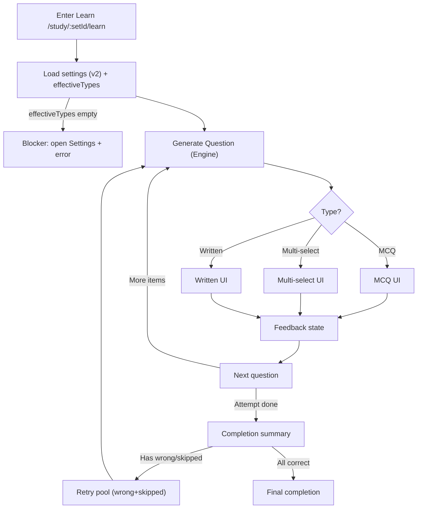
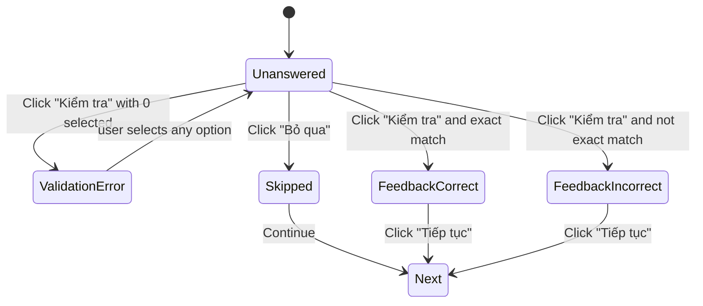
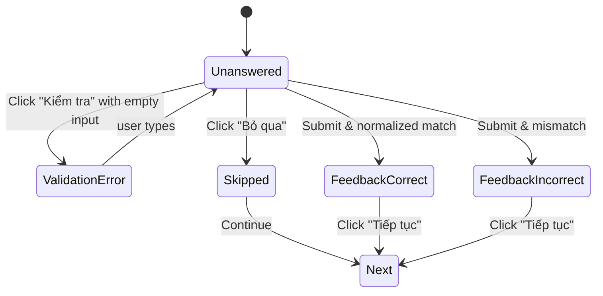

# Learn Mode v3 — Question Type Engine + Multi-select + Written (Quizlet-parity, VN-first)

**Version**: v3  
**Type**: Append Requirement (extends Learn Mode v1 + Learn Mode v2)  
**Doc language**: English  
**UI copy/labels**: Vietnamese-only  
**Primary goal**: Make Learn Mode feel closer to Quizlet by supporting multiple question types (MCQ + Multi-select + Written) with a deterministic, testable mixing engine, while preserving v1/v2 behaviors: persistence, adaptive retry, progress banner, and v2 settings overlay.

---

## 1) Scope

### 1.1 In Scope
- Implement **two new Learn question types**:
  - **Multi-select** (“Chọn tất cả đáp án đúng”)
  - **Written** (“Tự luận”)
- Implement **Question Type Engine** (mixing strategy) that:
  - Respects v2 settings toggles
  - Produces variety (avoid long streaks) with deterministic behavior
  - Applies settings changes **from NEXT question onward** (v2 mid-session policy)
- Add **VN-first UX** per type:
  - “Kiểm tra”, “Tiếp tục”, “Bỏ qua”
  - Validation messages and feedback messages
- Ensure **IME/Vietnamese typing** works for Written mode
- Add/extend persistence so refresh resumes correctly:
  - current question type + queue/order + statuses
- Provide E2E test coverage plan aligned with v3 behaviors

### 1.2 Out of Scope (v3)
- Reverse direction (Definition → Term) (reserved for v4)
- Starred-only learning (reserved for future)
- Sound effects implementation (toggle may exist from v2 but can remain no-op/disabled)
- “Spaced repetition across days” or mastery analytics beyond current Learn journey
- Fuzzy matching beyond the normalization rules specified here (no synonym/levenshtein)

---

## 2) Dependencies & Compatibility

### 2.1 Dependencies
v3 appends and depends on:
- **Learn v1**: MCQ core loop, adaptive retry (incorrect+skipped), basic persistence
- **Learn v2**: Settings overlay + per-set persistence, “Apply” model, mid-session next-question policy

### 2.2 Compatibility Constraints
v3 MUST NOT:
- Break Flashcards mode
- Break Bulk Import
- Change Set CRUD semantics
- Regress Learn v1/v2:
  - Adaptive retry behavior must remain
  - Progress banner must remain correct and non-decreasing (unless user explicitly resets per existing rules)
  - v2 settings overlay behavior remains Apply-based

---

## 3) Definitions & Terminology

### 3.1 Question Types
- **MCQ**: single-choice, 4 options (or fewer if insufficient distractors), exactly 1 correct.
- **Multi-select**: multiple correct options; user must select the exact set.
- **Written**: user types answer.

### 3.2 Learn Journey vs Attempt
- **Learn Journey**: a continuous learning run for a given setId, potentially including retries (attempts).
- **Attempt**: a pass over a pool:
  - Attempt 1 = main pool
  - Attempt >=2 = retry pool

### 3.3 Item Status (unchanged; session-scoped)
```ts
type LearnStatus = "unseen" | "correct" | "incorrect" | "skipped";
```
- Sticky correct rule (from existing append): once correct during the journey, stays correct until explicit reset.

### 3.4 Availability vs Enabled
- **Available**: supported by the current build (implemented).
- **Enabled**: user selected the type in v2 settings overlay.

Question type selection MUST use only (available AND enabled) types.

---

## 4) UX & Screens

### 4.1 Learn Screen Layout (common)
Common elements visible across all question types:
- Top banner:
  - Motivational VN line
  - “Tiến độ học” label
  - Progress (percent and/or count per existing implementation)
- Header actions:
  - “Tùy chọn” entry point (v2)
- Question area (type-specific)
- Action area:
  - “Bỏ qua” (only in Unanswered state)
  - “Kiểm tra” (for Written and Multi-select; optional for MCQ if MCQ remains immediate-check)
  - “Tiếp tục” (Feedback state)

### 4.2 Common State Names (for all types)
- **Unanswered**
- **ValidationError** (only for types requiring user input)
- **FeedbackCorrect**
- **FeedbackIncorrect**
- **CompletedAttempt**
- **CompletedFinal**

---

## 5) Question Type Engine (Mixing Strategy)

### 5.1 Objectives
- Variety: avoid long streaks of the same type when multiple types enabled.
- Deterministic: same inputs lead to same sequence (unless shuffleQuestions is enabled).
- Testable: engine decisions are reproducible for E2E tests.

### 5.2 Inputs
Engine input at each “Next question” decision:
- `enabledTypes`: subset of {MCQ, MULTI_SELECT, WRITTEN}
- `availableTypes`: subset of {MCQ, MULTI_SELECT, WRITTEN}
- `effectiveTypes = enabledTypes ∩ availableTypes`
- `currentAttemptPool`: ordered list of itemIds for attempt
- `statusByItemId`
- `lastTypeUsed` (nullable for first question)
- `shuffleQuestions` (boolean; from settings)
- `attemptNumber`

### 5.3 Output
- Next `itemId` (or end)
- Next `questionType`

### 5.4 Selection Rules
**Rule ENG-001 (effective types non-empty)**  
Engine must guarantee `effectiveTypes.length >= 1`. If not, Learn cannot proceed; must show blocking error and route user to Settings overlay.

**Rule ENG-010 (item selection)**  
Item selection order follows existing Learn logic:
- Attempt 1 uses the normal pool order (respecting existing shuffle logic if present)
- Retry attempts use retry pool order (incorrect+skipped only), and the retry pool may be shuffled per existing rules

> v3 does not redefine item selection; it defines how question types rotate.

**Rule ENG-020 (type rotation — simple round-robin)**  
If `effectiveTypes.length == 1`: always use that type.  
If `effectiveTypes.length >= 2`:
- Use a deterministic round-robin order over `effectiveTypes`
- Avoid repeating the same type twice in a row unless forced by having only 1 type enabled

**Rule ENG-021 (type order stability)**
- The type order list is stable within an attempt.
- If user applies settings mid-attempt (v2 Apply), the type order list is recomputed and takes effect starting NEXT question.

**Rule ENG-030 (shuffleQuestions effect)**
When `shuffleQuestions = true`:
- Item ordering may be shuffled per existing rules
- Type rotation remains deterministic relative to the shuffled item sequence

### 5.5 Mid-session Apply Policy (inherits v2)
- Applying settings changes does not reset current question.
- Engine uses new `effectiveTypes` starting NEXT question.

---

## 6) Question Type: MCQ (Single-choice)

### 6.1 Behavior (baseline)
MCQ remains as v1:
- 4 options if possible
- Selecting an option triggers evaluation (immediate or via “Kiểm tra” depending on existing v1)
- Feedback shows:
  - Correct: “Đúng rồi!”
  - Incorrect: “Chưa đúng” and show correct answer

### 6.2 Distractor Generation
- Choose 3 distractors from other items’ correct answers
- If insufficient unique distractors:
  - reduce options count to 3 or 2 but keep UX consistent
  - never crash

---

## 7) Question Type: Multi-select (“Chọn tất cả đáp án đúng”)

### 7.1 Presentation
- Title/subtitle: “Chọn tất cả đáp án đúng”
- Prompt shows the Term (v3 does not add reverse direction)
- Options list is multi-selectable (checkbox or toggle buttons)
- Buttons:
  - “Bỏ qua” (only Unanswered)
  - “Kiểm tra”
  - “Tiếp tục” (Feedback)

### 7.2 Option Set Construction
Multi-select needs multiple correct answers. For v3, we define:

**Definition MS-SET-001 (correct set size)**
- Correct set size = 2 by default
- May increase to 3 for larger sets (optional), but MUST be deterministic.
- If set too small to build 2 correct answers reliably:
  - Multi-select is considered unavailable for that set during that Learn session
  - It must be disabled at runtime with helper text in Settings overlay:
    “Bộ thẻ quá ít để dùng dạng câu hỏi này.”

**MS-SET-010 (how to build a multi-select question)**
Given a “focus item” (current itemId), define:
- `correctOptions`: include the focus item’s correct answer PLUS 1 additional correct answer from another item (deterministically chosen, e.g., next item in pool with different answer).
- `wrongOptions`: fill remaining options from other items’ answers not in correctOptions.

**MS-SET-011 (option count)**
- Target total options = 6 (preferred for multi-select), but may be 4 minimum.
- Must not include duplicates by string-normalized comparison.

> If you prefer a simpler v3: total options fixed at 4, correct count = 2. This is allowed if consistent and documented. (Choose one and implement exactly.)

### 7.3 Interaction States
- **Unanswered**:
  - user can select/deselect multiple options
  - “Kiểm tra” enabled only if selectionCount > 0
- **ValidationError**:
  - if user clicks “Kiểm tra” with 0 selection
  - show inline error: “Hãy chọn ít nhất 1 đáp án.”
- **FeedbackCorrect/Incorrect**:
  - freeze selection
  - highlight:
    - correct options (green)
    - wrong selected options (red)
  - show feedback message:
    - Correct: “Đúng rồi!”
    - Incorrect: “Chưa đúng”
  - show “Tiếp tục” button
- “Bỏ qua” only allowed in Unanswered.

### 7.4 Evaluation
**BR-MS-001 (exact match required)**  
Correct if and only if:
- Selected set equals correctOptions set (same elements, order irrelevant)

**BR-MS-002**  
If user selected a subset of correct options but missed one:
- Incorrect

**BR-MS-003**  
If user selected any wrong option:
- Incorrect

### 7.5 Status update
- Correct => item.status becomes correct (sticky)
- Incorrect => item.status becomes incorrect (unless already correct)
- Skip => item.status becomes skipped (unless already correct)

---

## 8) Question Type: Written (“Tự luận”)

### 8.1 Presentation
- Title/subtitle: “Tự luận”
- Prompt shows Term
- Text input:
  - placeholder: “Nhập câu trả lời...”
- Buttons:
  - “Bỏ qua” (Unanswered only)
  - “Kiểm tra”
  - “Tiếp tục” (Feedback)

### 8.2 Validation
- If input empty on “Kiểm tra”:
  - show inline error: “Vui lòng nhập câu trả lời.”

### 8.3 Normalization & Matching Rules
We define a strict, deterministic normalization:

```text
normalize(s):
1) trim leading/trailing whitespace
2) replace all consecutive whitespace with a single space
3) toLowerCase()
4) DO NOT remove Vietnamese diacritics
5) DO NOT remove punctuation (v3 strict) unless explicitly enabled later
```

**BR-WR-001**
Given user submits input  
When normalizedInput == normalizedCorrectAnswer  
Then correct

**BR-WR-002**
Else incorrect

### 8.4 Feedback
- Correct: “Đúng rồi!”
- Incorrect: “Chưa đúng”
- Show correct answer line:
  - “Đáp án đúng là: {correctAnswer}”

### 8.5 IME/Vietnamese typing requirement
- Input MUST support Vietnamese IME typing and diacritics in real Chrome.
- No keypress-only automation assumptions.

---

## 9) Learn Completion & Adaptive Retry (unchanged behavior)
v3 MUST preserve existing completion behavior:
- On attempt completion:
  - if incorrect+skipped exist => “Chưa xong đâu” and “Học lại các câu sai (k)”
  - retry pool includes incorrect+skipped only
  - retry pool shuffled
- “Học lại từ đầu” resets statuses and progress (existing rules)

v3 must ensure:
- retry attempts may include mixed question types (based on settings + engine)
- but must never include unavailable types

---

## 10) Business Rules (Given/When/Then)

### 10.1 Engine & Type Selection
**BR-LRN-V3-001**  
Given Learn starts for setId  
When settings are loaded  
Then compute `effectiveTypes = enabled ∩ available`  
And initialize type rotation order for the attempt

**BR-LRN-V3-002**  
Given effectiveTypes has length 1  
Then all questions in that attempt use that type

**BR-LRN-V3-003**  
Given effectiveTypes has length >=2  
When generating next question  
Then choose questionType using round-robin rotation  
And avoid repeating same type twice in a row unless forced

**BR-LRN-V3-004 (mid-session apply)**  
Given user applies settings in v2 overlay  
Then changes take effect starting NEXT question  
And current question state remains unchanged

### 10.2 Multi-select validation
**BR-LRN-V3-MS-010**  
Given user clicks “Kiểm tra” with 0 selections  
Then show “Hãy chọn ít nhất 1 đáp án.”  
And stay in Unanswered

### 10.3 Written validation
**BR-LRN-V3-WR-010**  
Given user clicks “Kiểm tra” with empty input  
Then show “Vui lòng nhập câu trả lời.”  
And stay in Unanswered

### 10.4 Status updates (sticky correct)
**BR-LRN-V3-020**  
Given item.status is correct  
When user answers later incorrectly or skips  
Then status remains correct (sticky)

---

## 11) Mermaid Flows

### 11.1 Global Learn flow with multi types


### 11.2 Multi-select state machine


### 11.3 Written state machine


---

## 12) Validation & Edge Cases

### 12.1 Low card count
- If set too small:
  - MCQ may reduce options
  - Multi-select may become unavailable for this session (must be handled gracefully)

### 12.2 Duplicates
- When generating options, deduplicate by normalized string
- If too many duplicates reduce options count; never crash

### 12.3 Long text & multiline
- UI must wrap text, no overflow
- Buttons remain visible on mobile

### 12.4 Rapid clicking
- Prevent double-advance on “Tiếp tục”
- Prevent duplicate “Kiểm tra” submissions

### 12.5 Refresh mid-session
- Must restore:
  - current question type
  - current item
  - statuses
  - progress banner state
  - type engine position (so no weird repetition after refresh)

---

## 13) Test Plan (E2E checklist aligned with v3 prompt)

**T01** Learn entry works on desktop/mobile  
**T02** Settings toggles enable MCQ + Written + Multi-select (now available)  
**T03** Engine mixes types (observe at least 2 type switches)  
**T04** MCQ correct → feedback + continue  
**T05** MCQ incorrect → show correct answer  
**T06** Multi-select correct set → pass  
**T07** Multi-select partial selection → fail  
**T08** Multi-select select none → validation error  
**T09** Written correct with case differences → pass  
**T10** Written incorrect → show correct answer  
**T11** Written empty input → validation error  
**T12** VN diacritics typed in Written → matches correctly  
**T13** Skip behavior across all types → skipped returns later (per existing retry rules)  
**T14** Adaptive retry: 2 correct, 2 wrong → completion “Chưa xong đâu” + retry only wrong+skipped  
**T15** Shuffle questions toggle affects subsequent questions without crashing  
**T16** Refresh mid-session → resume (type, progress, current question)  
**T17** Rapid clicking Kiểm tra/Tiếp tục → no double-advance  
**T18** Mobile viewport: no clipped buttons  
**T19** Small set: graceful behavior  
**T20** Duplicate answers: options generation stable; no crash

---

## 14) Open Questions (must not be assumed)
1) Should Multi-select use 4 or 6 total options by default? (If not constrained by research spec, choose one deterministically before implementation.)  
2) Should Multi-select correct set size always be 2, or can it be 3 for larger sets?  
3) Should engine bias to Written after incorrect (Quizlet may do this but not confirmed in our spec)?  
4) Auto-advance on correct (Quizlet observed) — should we implement in v3 or keep manual “Tiếp tục”?

> v3 implementation must pick explicit answers for these before coding. If you decide to implement auto-advance, add explicit business rules and tests.
