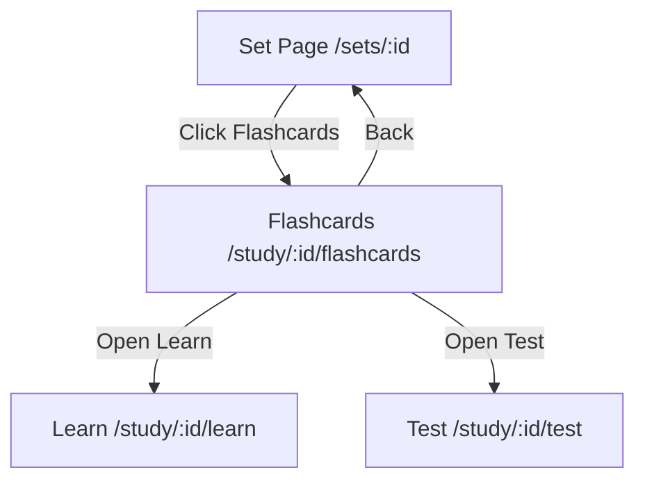
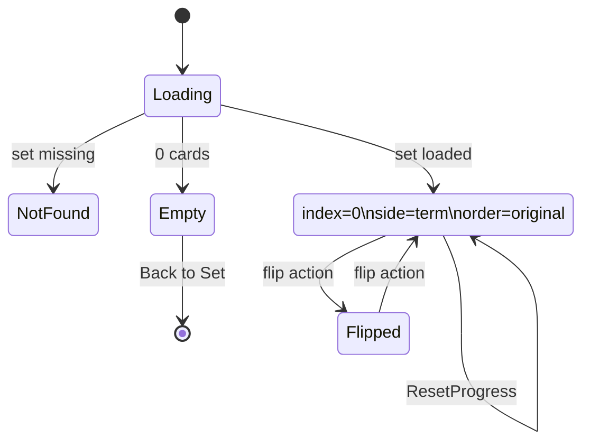
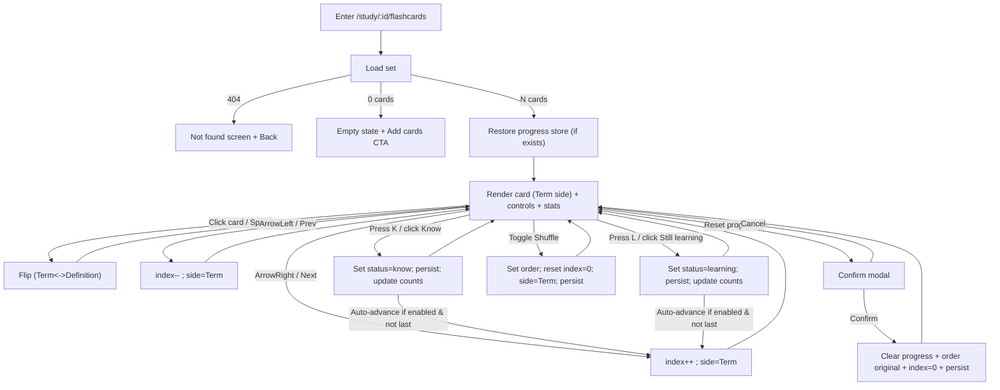

# Study Mode — Flashcards (Quizlet-like) Technical Requirement (VN-first)

**Doc type**: Technical Requirement (Source of Truth for Flashcards mode)  
**Role**: Senior UX/UI + Senior Product Owner + Senior Technical BA  
**Target users**: Vietnamese high-school & university students (non-technical)  
**Mode in scope**: Flashcards study mode (Quizlet-like)  
**Must-have**: “Know / Still learning” + progress saved (per setId)  
**Out of scope**: Learn mode, Test mode, sharing, folders (handled in other docs)

---

## 0) Goals & Non-goals

### 0.1 Product goals
1. **Instant study**: user can start studying within 2 seconds after mode loads.
2. **Low cognitive load**: user understands controls without instructions.
3. **Keyboard-first**: full mode usable without mouse (like Quizlet).
4. **Progress persistence**: “Know / Still learning” state survives refresh and return visits.
5. **Quizlet-like feel**: card flip animation, progress indicator, shuffle, smooth navigation.

### 0.2 UX goals
- Reduce “where am I / what do I do next” moments to zero.
- Always show:
  - Where they are (x/y)
  - What action is available (Next/Prev)
  - What they answered (Know / Still learning)
- Never punish mistakes; allow re-evaluation and reset.

### 0.3 Non-goals (v1)
- Spaced repetition algorithm beyond simple Know/Still learning.
- Sync progress across devices (local-only in v1 unless app already has backend).
- Audio/TTS.
- Printing/exporting.

---

## 1) Definitions

### 1.1 Entities
- **Set**: collection of cards
  - `id: string`
  - `title: string`
  - `cards: Card[]`
- **Card**
  - `id: string` (or index-based if not available)
  - `term: string`
  - `definition: string`

### 1.2 Flashcards session (client-side state)
- `setId: string`
- `order: "original" | "shuffled"`
- `shuffledSeed?: string` (optional; for stable shuffle)
- `index: number` (0-based)
- `side: "term" | "definition"` (current face)
- `knownMap: Record<CardKey, "know" | "learning" | "unset">`
- `lastUpdatedAt: ISOString`

**CardKey**:
- Prefer stable ID: `card.id`
- If no ID exists, use deterministic key: `${setId}::${indexInOriginal}`

---

## 2) Routes & Entry Points

### 2.1 Route
- `/study/:setId/flashcards`

### 2.2 Entry points
- From Set page `/sets/:setId` user clicks **Flashcards**
- From Home list, user can click **Study → Flashcards** (optional shortcut)

---

## 3) Screen Inventory (Flashcards Mode)

### 3.1 Required UI components
1. **Header bar**
   - Back button (to Set page)
   - Set title (truncate with tooltip)
   - Overflow menu (optional): Reset progress, Report issue (optional)
2. **Progress row**
   - `x / y` indicator (current position)
   - Known count + Learning count (simple stats)
3. **Card stage**
   - Large card with flip interaction
   - “Tap to flip” hint (only first time or subtle)
4. **Action row**
   - Prev button
   - Flip button (optional if card itself is clickable)
   - Next button
5. **Confidence row**
   - Button: **Still learning**
   - Button: **Know**
6. **Utility row**
   - Shuffle toggle (ON/OFF)
   - Reset progress CTA (confirm)

### 3.2 Responsive requirements
- Mobile:
  - Card takes ~70% height
  - Controls pinned bottom
  - Buttons large (thumb friendly)
- Desktop:
  - Card centered, max width ~720px
  - Keyboard hints may be shown subtly

---

## 4) Navigation & Global Flow

### 4.1 Global navigation flow


---

## 5) Flashcards State Machine (Core)

### 5.1 State diagram


---

## 6) Detailed UX Interaction Rules (No assumptions)

## 6.1 Card Flip Interaction

### Business rules
**BR-FLIP-01**
- Given card is visible
- When user clicks/taps the card body
- Then card flips between Term and Definition
- And flip has animation (150–250ms, subtle)
- And focus remains on card (keyboard users)

**BR-FLIP-02**
- Given user presses `Space`
- When card is in focus OR stage is active
- Then flip card

**BR-FLIP-03**
- Given card flips to Definition
- When user moves Next/Prev
- Then side resets to Term (Quizlet-like default)

### Validation rules
- If current card has empty `term` or `definition`, render placeholder:
  - Term missing: “(No term)”
  - Definition missing: “(No definition)”
- Still allow flip/navigation (do not block study)

---

## 6.2 Next / Prev Navigation

### Business rules
**BR-NAV-01**
- Given index < last
- When user clicks Next OR presses `ArrowRight`
- Then index increments by 1
- And side resets to Term
- And scroll position does not jump

**BR-NAV-02**
- Given index > 0
- When user clicks Prev OR presses `ArrowLeft`
- Then index decrements by 1
- And side resets to Term

**BR-NAV-03 (Bounds)**
- Given index == 0
- Then Prev button disabled
- And pressing `ArrowLeft` does nothing (no error)

**BR-NAV-04 (Bounds)**
- Given index == last
- Then Next button disabled
- And pressing `ArrowRight` does nothing

---

## 6.3 Know / Still learning Actions (Core value)

### UX guidance
- Buttons are always visible under card.
- These actions are **not a quiz**; they are self-rating.
- After marking, user should feel progress immediately.

### Business rules
**BR-KNOW-01**
- Given a card is shown
- When user clicks **Know**
- Then mark current card status = `know`
- And persist to progress store immediately
- And show immediate visual confirmation:
  - button becomes “selected” state (or shows checkmark)
  - optional micro-toast: “Marked as Know” (non-blocking)

**BR-LEARN-01**
- Given a card is shown
- When user clicks **Still learning**
- Then mark current card status = `learning`
- And persist immediately
- And show confirmation

**BR-SET-01 (Toggle)**
- Given card already marked Know
- When user clicks Still learning
- Then update status to learning (overwrite)
- And persist

**BR-SET-02 (Unset)**
- Given card is marked Know or Learning
- When user clicks the selected state again (optional)
- Then allow unset to “unset”
- **Decision**: v1 should support unset to reduce friction and match user expectation.
  - Unset behavior: clicking the active selection again sets to `unset`.

**BR-AUTO-ADV-01 (Optional but recommended)**
- Given user clicks Know or Still learning
- Then auto-advance to Next card after 250–400ms
- Unless user is on last card, then stay.
- Auto-advance must be configurable (feature flag) but ON by default for student speed.

---

## 6.4 Progress Indicator & Stats

### Business rules
**BR-PROG-01**
- Given total cards = N
- Then progress indicator shows `(index+1) / N`

**BR-PROG-02**
- Known count = number of cards with status know
- Learning count = number of cards with status learning
- Unset count is optional to show (can be hidden)

**BR-PROG-03**
- Counts update in real-time immediately after marking.

---

## 6.5 Shuffle (Quizlet-like)

### UX expectation
Shuffle makes study feel less repetitive.
Users must be able to return to original order.

### Business rules
**BR-SHUFF-01**
- Given shuffle is OFF and user toggles shuffle ON
- Then create a shuffled order for current set
- And reset index = 0
- And side = Term
- And persist shuffle state (order mode) in progress store

**BR-SHUFF-02**
- Given shuffle is ON and user toggles shuffle OFF
- Then restore original order
- And reset index = 0
- And side = Term
- And persist

**BR-SHUFF-03 (Stability)**
- If shuffle is ON and user refreshes page
- Then preserve shuffle ON state
- And preserve the shuffled order if possible (via seed or stored order)
- If cannot preserve exact order, it’s acceptable to reshuffle but must keep ON.

---

## 6.6 Reset Progress

### UX requirement
Reset is destructive; must be confirmed.

### Business rules
**BR-RESET-01**
- Given user clicks Reset progress
- Then show confirm modal:
  - Title: “Reset progress?”
  - Body: “This will clear Know/Still learning for this set.”
  - Buttons: Cancel / Reset

**BR-RESET-02**
- Given user confirms Reset
- Then clear knownMap for this set
- And reset order to original
- And index = 0
- And side = term
- And persist immediately
- And show toast “Progress reset”

**BR-RESET-03**
- Given user cancels
- Then return to study with no changes

---

## 7) Data Persistence (Progress Store)

### 7.1 Storage scope
- Keyed by setId
- Stores:
  - knownMap
  - order mode + (optional) shuffled order/seed
  - last index (optional)
  - last updated timestamp

### 7.2 Persistence rules
**BR-PERSIST-01**
- Given user marks Know/Learning/Unset
- Then persist within the same tick (no debounce longer than 250ms)

**BR-PERSIST-02**
- Given user refreshes the page
- Then restore:
  - knownMap
  - shuffle state
  - last index (recommended)
  - side resets to term on load (recommended to avoid confusion)

**BR-PERSIST-03 (Corruption)**
- Given stored data is corrupted/unparseable
- Then ignore stored data and start fresh
- And do not crash
- Optional toast: “We reset your study progress due to an issue.”

### 7.3 Suggested storage mechanism
- `localStorage` for v1
- If app already has backend user profile, can also store server-side later (out of scope)

---

## 8) Error / Empty / Not Found UX

### 8.1 Set Not Found
**BR-ERR-01**
- Given set fetch returns 404
- Then show Not Found screen:
  - “Set not found”
  - Button “Back to your sets”
- Do not show broken UI

### 8.2 Empty Set (0 cards)
**BR-EMP-01**
- Given set has 0 cards
- Then show empty state:
  - “No cards yet”
  - CTA “Add cards”
  - CTA navigates to Edit Set `/sets/:id/edit`

### 8.3 Loading
**BR-LOAD-01**
- Show skeleton card + disabled controls
- Avoid layout shift

---

## 9) Accessibility & Keyboard Shortcuts (Mandatory)

### 9.1 Keyboard map
- `Space`: flip
- `ArrowRight`: next
- `ArrowLeft`: prev
- `K`: mark Know
- `L`: mark Still learning
- `S`: toggle shuffle
- `R`: reset (opens confirm modal, does not auto-confirm)
- `Esc`: close modal

### 9.2 A11y rules
- Card must be focusable (`tabIndex=0`)
- Announce flip via aria-live optional:
  - “Showing definition” / “Showing term”
- Buttons must have accessible labels
- Focus trap in confirm modal

---

## 10) UX Copy (Non-authoritative)
Exact strings should be sourced from a copy doc later. For v1, use simple English or Vietnamese consistent with app.

---

## 11) Mermaid Flows (Detailed per feature)

### 11.1 Study Session Flow (Happy path + decisions)


---

## 12) Business Rule Catalog (Given/When/Then) — Full List

> Use these IDs in code comments and tests.

- BR-FLIP-01..03
- BR-NAV-01..04
- BR-KNOW-01
- BR-LEARN-01
- BR-SET-01..02
- BR-AUTO-ADV-01
- BR-PROG-01..03
- BR-SHUFF-01..03
- BR-RESET-01..03
- BR-PERSIST-01..03
- BR-ERR-01
- BR-EMP-01
- BR-LOAD-01

---

## 13) Test Plan (Mandatory)

### 13.1 E2E Tests (Playwright) — must pass before merge

#### T-FC-01 Load happy path
- Given set exists with N cards
- When user enters flashcards
- Then card shows term of index 0
- And progress shows 1/N

#### T-FC-02 Flip by click and Space
- When click card → flips
- When press Space → flips back

#### T-FC-03 Next/Prev bounds
- At first card: Prev disabled
- At last card: Next disabled

#### T-FC-04 Mark Know and persist
- Mark card 1 as Know
- Refresh page
- Expect card 1 still marked Know
- Known count correct

#### T-FC-05 Mark Still learning + overwrite
- Mark as Know then mark Still learning
- Expect status changes, counts update

#### T-FC-06 Unset behavior
- Click Know again (selected) → unset
- Counts update

#### T-FC-07 Shuffle on/off
- Toggle shuffle on → index reset 0
- Navigate few cards
- Refresh → shuffle still ON
- Toggle shuffle off → original order restored

#### T-FC-08 Reset progress confirm
- Click reset → modal appears
- Cancel → nothing changes
- Confirm → statuses cleared, index reset

#### T-FC-09 Empty set
- Set with 0 cards shows empty state + Add cards CTA

#### T-FC-10 Not found
- Invalid setId shows not found + back link

#### T-FC-11 Keyboard shortcuts
- K marks Know
- L marks Learning
- S toggles shuffle
- R opens reset modal
- Esc closes modal

### 13.2 Component / Integration tests (React Testing Library) — recommended
- Card flip state transitions
- knownMap reducer/store correctness
- shuffle order generation determinism with seed

### 13.3 Performance / UX tests (manual checklist)
- No layout shift on load
- Controls reachable on small phones
- Buttons large enough (44px min touch)
- Animation not janky

---

## 14) Implementation Notes (Non-binding but recommended)

- Use a dedicated store:
  - `flashcardsStore(setId)` encapsulating:
    - order, index, side, knownMap
- Persist store with:
  - `loadFlashcardsProgress(setId)`
  - `saveFlashcardsProgress(setId, data)`
- Prefer deterministic shuffle:
  - store `shuffledOrder: CardKey[]` OR `seed`

---

## 15) AI Implementation Prompt (Antigravity / Sonnet 4.5)

```text
You are implementing Flashcards Study Mode (Quizlet-like) for a Vietnamese student audience.

Read this requirement fully. Do not assume anything not defined.

Scope:
- Route: /study/:setId/flashcards
- Features: flip (click/space), next/prev, shuffle, progress indicator, know/still learning with persistence, reset progress with confirm modal.
- Persistence: per setId progress store (localStorage) including knownMap, shuffle state, and last index. Handle corruption safely.

Rules:
- Follow all Business Rules (BR-*) and Mermaid flow exactly.
- Implement keyboard shortcuts: Space, ArrowLeft/Right, K, L, S, R, Esc.
- Side resets to Term on navigation and on mode load.

Testing:
- Implement Playwright E2E tests listed in section 13.1.
- Tests must cover persistence, bounds, shuffle, reset confirm, empty/not found, keyboard shortcuts.
- Use browser-based UI checks in Antigravity.

Output:
- List changed files
- Show test results (pass/fail)
- Explain how each BR is satisfied (brief mapping)
```

---

**END OF FLASHCARDS TECHNICAL REQUIREMENT**
